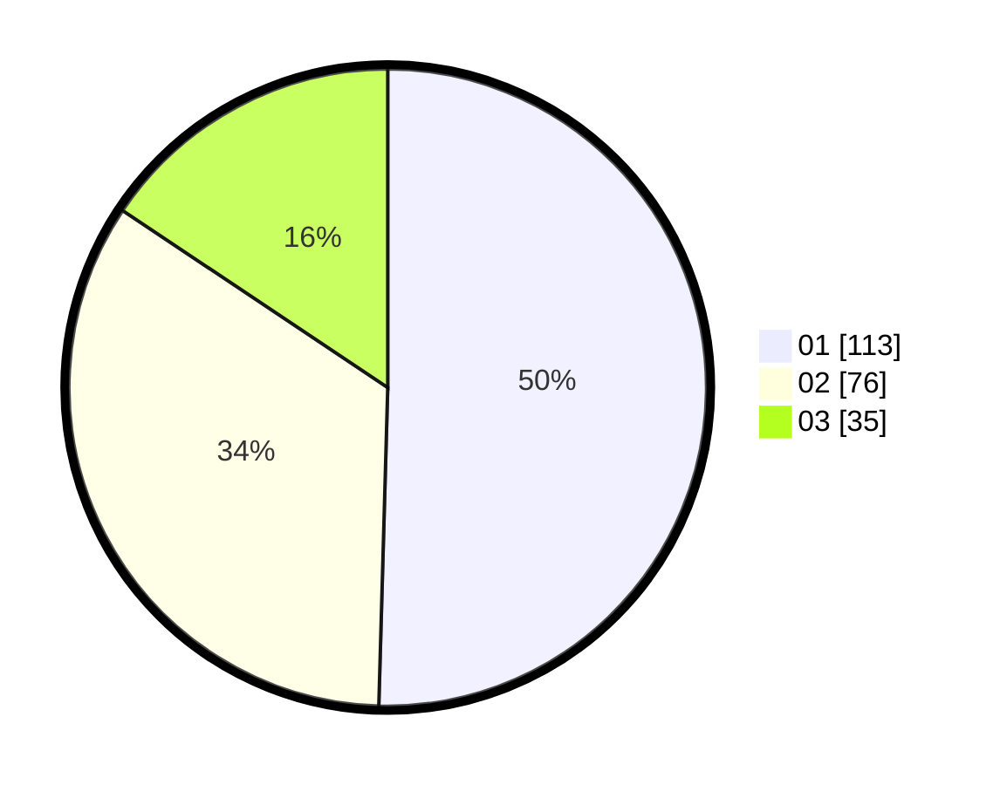

# Hasil

Hasil perolehan suara paslon dapat dilihat pada file paslon-01.txt, paslon-02.txt, dan paslon-03.txt.

Jika tidak ada, artinya data tersebut belum ada pada SIREKAP.

## Perolehan Suara

 * Paslon 01: **113**.
 * Paslon 02: **76**.
 * Paslon 03: **35**.

## Foto C Plano

https://sirekap-obj-formc.kpu.go.id/c2a9/pemilu/ppwp/31/74/10/10/03/3174101003156-20240215-010554--0d09abc4-7161-4229-831d-f66dcb5d7987.jpg

https://sirekap-obj-formc.kpu.go.id/c2a9/pemilu/ppwp/31/74/10/10/03/3174101003156-20240215-010614--3384b5a0-b8c0-4500-8c18-8e28b82152bf.jpg

https://sirekap-obj-formc.kpu.go.id/c2a9/pemilu/ppwp/31/74/10/10/03/3174101003156-20240215-010629--3af99ad6-89bc-4312-a9e6-d46bcc2dc9ca.jpg
