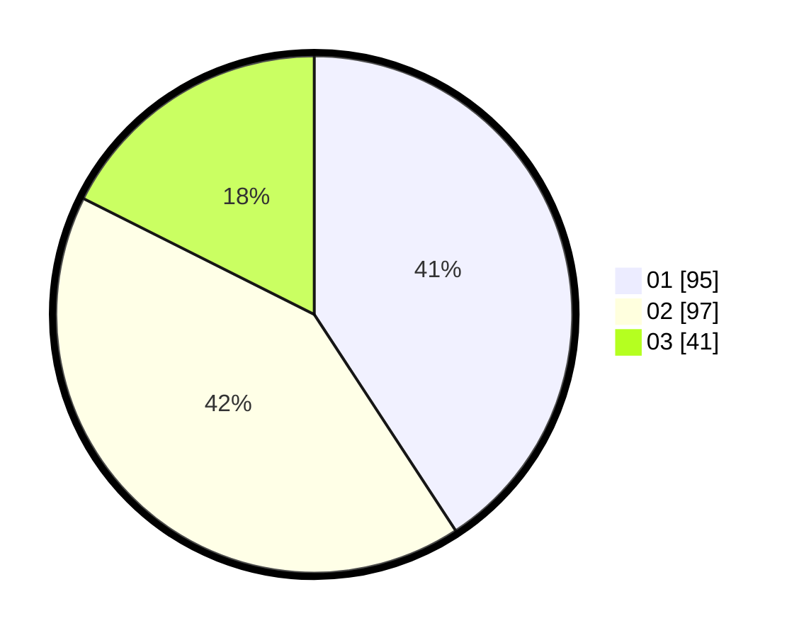

# Hasil

Hasil perolehan suara paslon dapat dilihat pada file paslon-01.txt, paslon-02.txt, dan paslon-03.txt.

Jika tidak ada, artinya data tersebut belum ada pada SIREKAP.

## Perolehan Suara

 * Paslon 01: **95**.
 * Paslon 02: **97**.
 * Paslon 03: **41**.

## Foto C Plano

https://sirekap-obj-formc.kpu.go.id/ac72/pemilu/ppwp/31/74/10/10/03/3174101003157-20240214-193654--217e38ea-d0a3-48cf-9202-c1383fe5bcd1.jpg

https://sirekap-obj-formc.kpu.go.id/ac72/pemilu/ppwp/31/74/10/10/03/3174101003157-20240214-201119--03cdccc3-3d9f-4fac-8e54-8ffcbfae894f.jpg

https://sirekap-obj-formc.kpu.go.id/ac72/pemilu/ppwp/31/74/10/10/03/3174101003157-20240214-193839--50b12a27-f03f-4752-b535-363fa3618c54.jpg

## DATA PEMILIH TETAP

Jumlah pemilih dalam DPT: **883**.
 * L: **438**.
 * P: **152**.

## DATA PENGGUNA HAK PILIH

Jumlah pengguna hak pilih dalam DPT: **228**.
 * L: **107**.
 * P: **121**.

Jumlah pengguna hak pilih dalam DPTb: **5**.
 * L: **2**.
 * P: **3**.

Jumlah pengguna hak pilih dalam DPK: **1**.
 * L: **0**.
 * P: **1**.

Jumlah pengguna hak pilih: **234**.
 * L: **109**.
 * P: **125**.

## JUMLAH SUARA SAH DAN TIDAK SAH

JUMLAH SELURUH SUARA SAH: **233**.

JUMLAH SUARA TIDAK SAH: **1**.

JUMLAH SELURUH SUARA SAH DAN SUARA TIDAK SAH: **234**.
