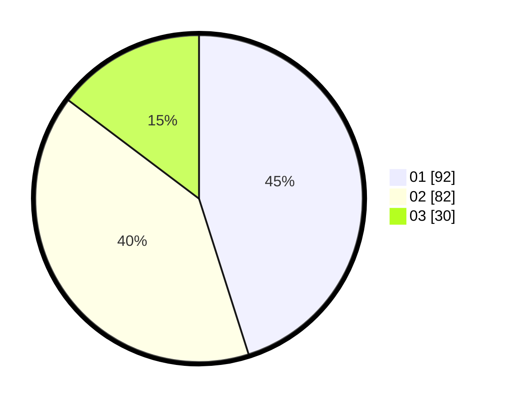

# Hasil

Hasil perolehan suara paslon dapat dilihat pada file paslon-01.txt, paslon-02.txt, dan paslon-03.txt.

Jika tidak ada, artinya data tersebut belum ada pada SIREKAP.

## Perolehan Suara

 * Paslon 01: **92**.
 * Paslon 02: **82**.
 * Paslon 03: **30**.

## Foto C Plano

https://sirekap-obj-formc.kpu.go.id/e3cc/pemilu/ppwp/31/74/10/10/03/3174101003170-20240214-155435--44b9e6ff-a1a2-4935-a8e8-98b3420947be.jpg

https://sirekap-obj-formc.kpu.go.id/e3cc/pemilu/ppwp/31/74/10/10/03/3174101003170-20240216-125610--288595cd-64cd-4d8f-89f2-90ac62a6225b.jpg

https://sirekap-obj-formc.kpu.go.id/e3cc/pemilu/ppwp/31/74/10/10/03/3174101003170-20240216-125609--9fe3eb79-d5a3-4c5e-85ec-2f7cd92d50d2.jpg

## DATA PEMILIH TETAP

Jumlah pemilih dalam DPT: **259**.
 * L: **124**.
 * P: **135**.

## DATA PENGGUNA HAK PILIH

Jumlah pengguna hak pilih dalam DPT: **204**.
 * L: **94**.
 * P: **110**.

Jumlah pengguna hak pilih dalam DPTb: **2**.
 * L: **1**.
 * P: **1**.

Jumlah pengguna hak pilih dalam DPK: **0**.
 * L: **0**.
 * P: **0**.

Jumlah pengguna hak pilih: **206**.
 * L: **95**.
 * P: **111**.

## JUMLAH SUARA SAH DAN TIDAK SAH

JUMLAH SELURUH SUARA SAH: **203**.

JUMLAH SUARA TIDAK SAH: **3**.

JUMLAH SELURUH SUARA SAH DAN SUARA TIDAK SAH: **206**.
