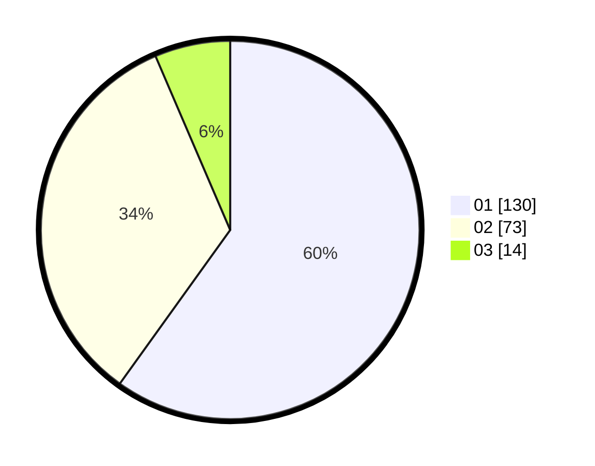

# Hasil

Hasil perolehan suara paslon dapat dilihat pada file paslon-01.txt, paslon-02.txt, dan paslon-03.txt.

Jika tidak ada, artinya data tersebut belum ada pada SIREKAP.

## Perolehan Suara

 * Paslon 01: **130**.
 * Paslon 02: **73**.
 * Paslon 03: **14**.

## Foto C Plano

https://sirekap-obj-formc.kpu.go.id/ec4d/pemilu/ppwp/31/74/10/10/03/3174101003180-20240215-032002--e43eb70a-0e2b-4b44-bb35-ebdb4c846e6b.jpg

https://sirekap-obj-formc.kpu.go.id/ec4d/pemilu/ppwp/31/74/10/10/03/3174101003180-20240215-032054--c8f7ed8c-8707-410c-914f-e0348d382e5c.jpg

https://sirekap-obj-formc.kpu.go.id/ec4d/pemilu/ppwp/31/74/10/10/03/3174101003180-20240216-223938--5692a0be-a84a-45ee-96ae-6a5e3555669a.jpg

## DATA PEMILIH TETAP

Jumlah pemilih dalam DPT: **277**.
 * L: **135**.
 * P: **142**.

## DATA PENGGUNA HAK PILIH

Jumlah pengguna hak pilih dalam DPT: **219**.
 * L: **109**.
 * P: **110**.

Jumlah pengguna hak pilih dalam DPTb: **0**.
 * L: **0**.
 * P: **0**.

Jumlah pengguna hak pilih dalam DPK: **5**.
 * L: **3**.
 * P: **2**.

Jumlah pengguna hak pilih: **224**.
 * L: **112**.
 * P: **112**.

## JUMLAH SUARA SAH DAN TIDAK SAH

JUMLAH SELURUH SUARA SAH: **217**.

JUMLAH SUARA TIDAK SAH: **7**.

JUMLAH SELURUH SUARA SAH DAN SUARA TIDAK SAH: **224**.
