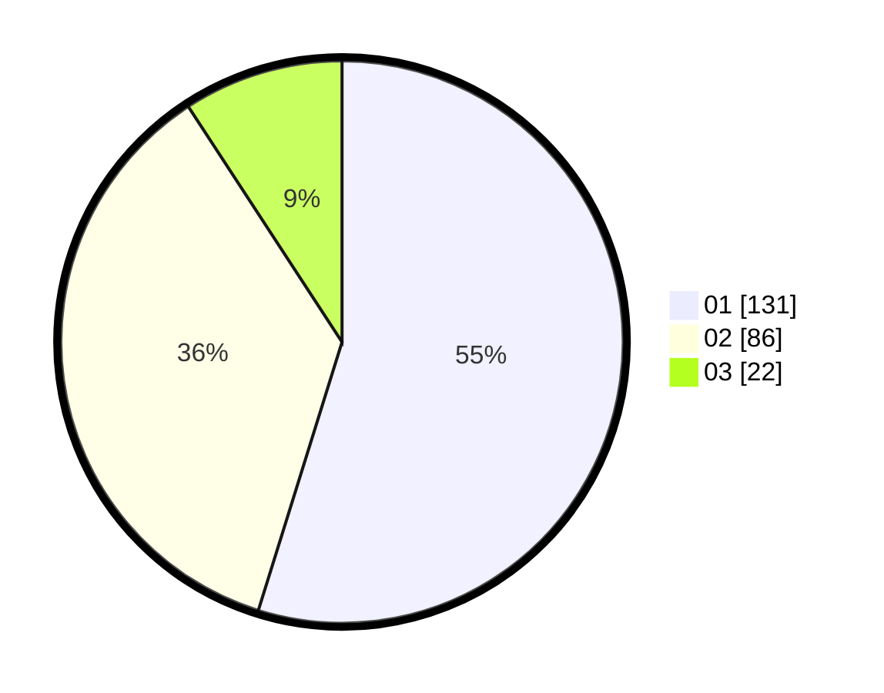

# Hasil

Hasil perolehan suara paslon dapat dilihat pada file paslon-01.txt, paslon-02.txt, dan paslon-03.txt.

Jika tidak ada, artinya data tersebut belum ada pada SIREKAP.

## Perolehan Suara

 * Paslon 01: **131**.
 * Paslon 02: **86**.
 * Paslon 03: **22**.

## Foto C Plano

https://sirekap-obj-formc.kpu.go.id/150a/pemilu/ppwp/31/74/10/10/03/3174101003184-20240214-191352--73461467-80c1-4231-9756-1db6b3ecb2f5.jpg

https://sirekap-obj-formc.kpu.go.id/150a/pemilu/ppwp/31/74/10/10/03/3174101003184-20240214-191416--29d2ad89-d2ef-4a25-96f6-7a6df0f6e569.jpg

https://sirekap-obj-formc.kpu.go.id/150a/pemilu/ppwp/31/74/10/10/03/3174101003184-20240214-193303--0c4c4d0c-3395-401b-a5d5-4fc24799947b.jpg

## DATA PEMILIH TETAP

Jumlah pemilih dalam DPT: **291**.
 * L: **146**.
 * P: **145**.

## DATA PENGGUNA HAK PILIH

Jumlah pengguna hak pilih dalam DPT: **239**.
 * L: **125**.
 * P: **114**.

Jumlah pengguna hak pilih dalam DPTb: **0**.
 * L: **0**.
 * P: **0**.

Jumlah pengguna hak pilih dalam DPK: **4**.
 * L: **2**.
 * P: **2**.

Jumlah pengguna hak pilih: **243**.
 * L: **127**.
 * P: **116**.

## JUMLAH SUARA SAH DAN TIDAK SAH

JUMLAH SELURUH SUARA SAH: **239**.

JUMLAH SUARA TIDAK SAH: **4**.

JUMLAH SELURUH SUARA SAH DAN SUARA TIDAK SAH: **243**.
