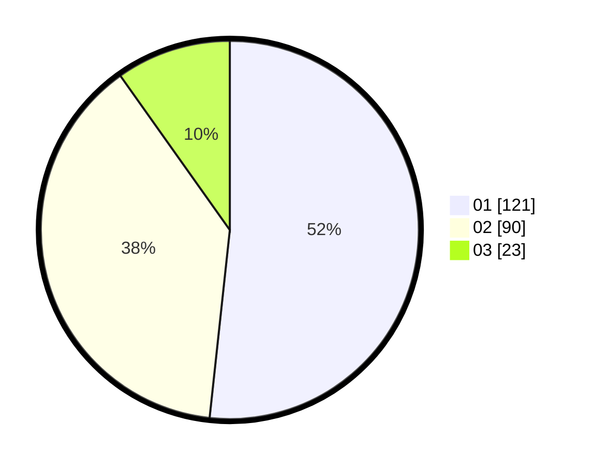

# Hasil

Hasil perolehan suara paslon dapat dilihat pada file paslon-01.txt, paslon-02.txt, dan paslon-03.txt.

Jika tidak ada, artinya data tersebut belum ada pada SIREKAP.

## Perolehan Suara

 * Paslon 01: **121**.
 * Paslon 02: **90**.
 * Paslon 03: **23**.

## Foto C Plano

https://sirekap-obj-formc.kpu.go.id/0abc/pemilu/ppwp/31/74/10/10/03/3174101003185-20240214-160056--63d4f5ed-ba09-4562-bcb4-24aac8fe819f.jpg

https://sirekap-obj-formc.kpu.go.id/0abc/pemilu/ppwp/31/74/10/10/03/3174101003185-20240214-160153--6e74e08d-f833-466f-8ce1-193ecc0808dc.jpg

https://sirekap-obj-formc.kpu.go.id/0abc/pemilu/ppwp/31/74/10/10/03/3174101003185-20240214-185902--bc1b17c6-34c9-436a-84ab-149175065948.jpg

## DATA PEMILIH TETAP

Jumlah pemilih dalam DPT: **293**.
 * L: **156**.
 * P: **137**.

## DATA PENGGUNA HAK PILIH

Jumlah pengguna hak pilih dalam DPT: **239**.
 * L: **123**.
 * P: **116**.

Jumlah pengguna hak pilih dalam DPTb: **1**.
 * L: **0**.
 * P: **1**.

Jumlah pengguna hak pilih dalam DPK: **0**.
 * L: **0**.
 * P: **0**.

Jumlah pengguna hak pilih: **240**.
 * L: **123**.
 * P: **117**.

## JUMLAH SUARA SAH DAN TIDAK SAH

JUMLAH SELURUH SUARA SAH: **234**.

JUMLAH SUARA TIDAK SAH: **6**.

JUMLAH SELURUH SUARA SAH DAN SUARA TIDAK SAH: **240**.
