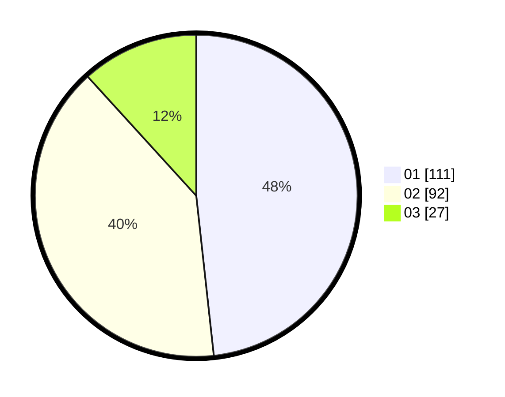

# Hasil

Hasil perolehan suara paslon dapat dilihat pada file paslon-01.txt, paslon-02.txt, dan paslon-03.txt.

Jika tidak ada, artinya data tersebut belum ada pada SIREKAP.

## Perolehan Suara

 * Paslon 01: **111**.
 * Paslon 02: **92**.
 * Paslon 03: **27**.

## Foto C Plano

https://sirekap-obj-formc.kpu.go.id/dc12/pemilu/ppwp/31/74/10/10/04/3174101004001-20240216-162146--f6cdff42-e2be-4e26-9fd8-e80703aadc33.jpg

https://sirekap-obj-formc.kpu.go.id/dc12/pemilu/ppwp/31/74/10/10/04/3174101004001-20240216-162227--c89333a9-a291-46c8-b6a8-15d0d8dd94e0.jpg

https://sirekap-obj-formc.kpu.go.id/dc12/pemilu/ppwp/31/74/10/10/04/3174101004001-20240216-162329--650758fd-6899-400c-b534-61ae33a22869.jpg

## DATA PEMILIH TETAP

Jumlah pemilih dalam DPT: **277**.
 * L: **140**.
 * P: **137**.

## DATA PENGGUNA HAK PILIH

Jumlah pengguna hak pilih dalam DPT: **230**.
 * L: **111**.
 * P: **119**.

Jumlah pengguna hak pilih dalam DPTb: **0**.
 * L: **0**.
 * P: **0**.

Jumlah pengguna hak pilih dalam DPK: **2**.
 * L: **1**.
 * P: **1**.

Jumlah pengguna hak pilih: **232**.
 * L: **112**.
 * P: **120**.

## JUMLAH SUARA SAH DAN TIDAK SAH

JUMLAH SELURUH SUARA SAH: **230**.

JUMLAH SUARA TIDAK SAH: **2**.

JUMLAH SELURUH SUARA SAH DAN SUARA TIDAK SAH: **232**.
