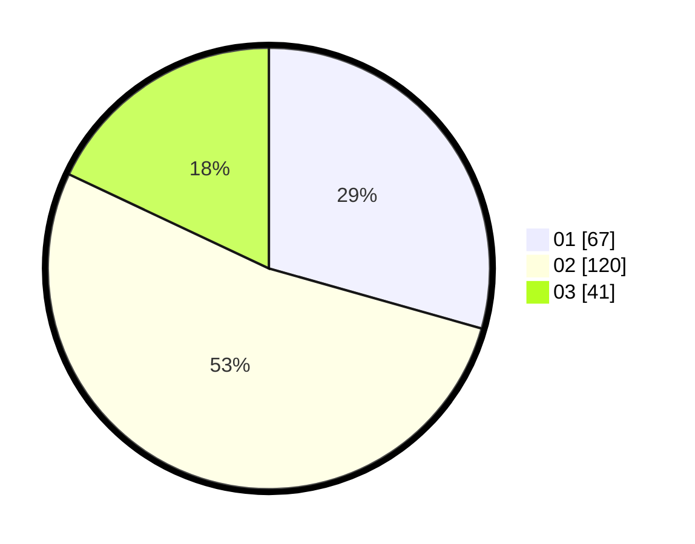

# Hasil

Hasil perolehan suara paslon dapat dilihat pada file paslon-01.txt, paslon-02.txt, dan paslon-03.txt.

Jika tidak ada, artinya data tersebut belum ada pada SIREKAP.

## Perolehan Suara

 * Paslon 01: **67**.
 * Paslon 02: **120**.
 * Paslon 03: **41**.

## Foto C Plano

https://sirekap-obj-formc.kpu.go.id/2510/pemilu/ppwp/31/74/10/10/04/3174101004029-20240218-164813--f51438d4-15ba-4128-bbcf-de998ca14502.jpg

https://sirekap-obj-formc.kpu.go.id/2510/pemilu/ppwp/31/74/10/10/04/3174101004029-20240218-164815--114f3a22-09f9-4fca-be0f-b7d1b4f9a0f6.jpg

https://sirekap-obj-formc.kpu.go.id/2510/pemilu/ppwp/31/74/10/10/04/3174101004029-20240218-164814--da708ebb-209b-4db2-9747-f535402734c6.jpg

## DATA PEMILIH TETAP

Jumlah pemilih dalam DPT: **269**.
 * L: **133**.
 * P: **136**.

## DATA PENGGUNA HAK PILIH

Jumlah pengguna hak pilih dalam DPT: **223**.
 * L: **109**.
 * P: **114**.

Jumlah pengguna hak pilih dalam DPTb: **1**.
 * L: **0**.
 * P: **1**.

Jumlah pengguna hak pilih dalam DPK: **9**.
 * L: **4**.
 * P: **5**.

Jumlah pengguna hak pilih: **233**.
 * L: **113**.
 * P: **120**.

## JUMLAH SUARA SAH DAN TIDAK SAH

JUMLAH SELURUH SUARA SAH: **228**.

JUMLAH SUARA TIDAK SAH: **5**.

JUMLAH SELURUH SUARA SAH DAN SUARA TIDAK SAH: **233**.
