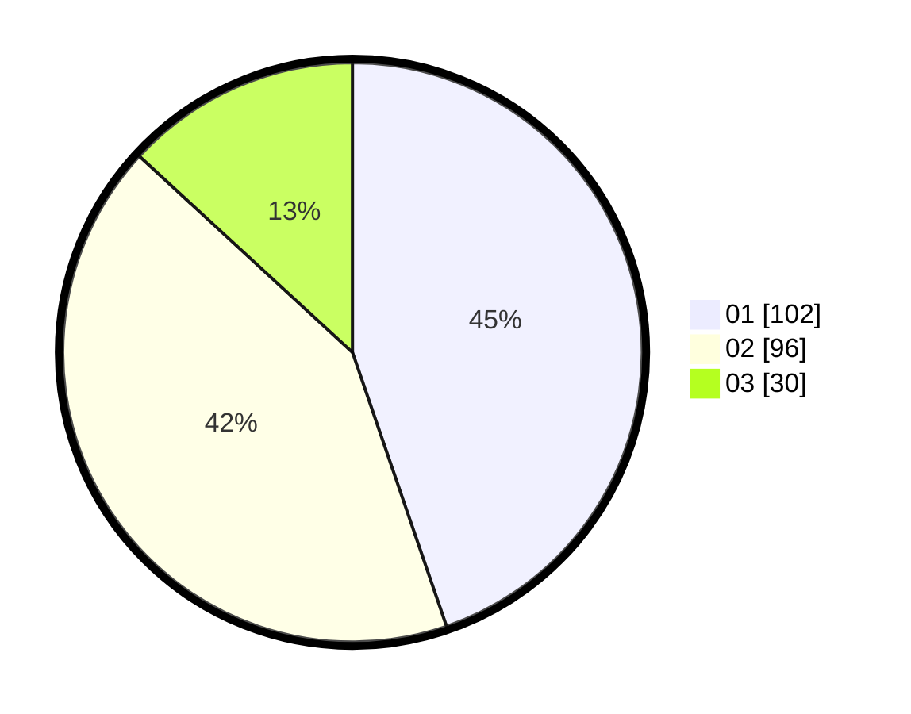

# Hasil

Hasil perolehan suara paslon dapat dilihat pada file paslon-01.txt, paslon-02.txt, dan paslon-03.txt.

Jika tidak ada, artinya data tersebut belum ada pada SIREKAP.

## Perolehan Suara

 * Paslon 01: **102**.
 * Paslon 02: **96**.
 * Paslon 03: **30**.

## Foto C Plano

https://sirekap-obj-formc.kpu.go.id/bb5b/pemilu/ppwp/31/74/10/10/04/3174101004041-20240214-162239--af6708b7-50ae-4b08-8f27-96a2c4760955.jpg

https://sirekap-obj-formc.kpu.go.id/bb5b/pemilu/ppwp/31/74/10/10/04/3174101004041-20240214-155541--46524665-2c74-4cbd-bf34-878b3b531a01.jpg

https://sirekap-obj-formc.kpu.go.id/bb5b/pemilu/ppwp/31/74/10/10/04/3174101004041-20240214-155612--d1c58340-752e-49fd-9e66-bc35668d415d.jpg

## DATA PEMILIH TETAP

Jumlah pemilih dalam DPT: **228**.
 * L: **97**.
 * P: **131**.

## DATA PENGGUNA HAK PILIH

Jumlah pengguna hak pilih dalam DPT: **225**.
 * L: **96**.
 * P: **129**.

Jumlah pengguna hak pilih dalam DPTb: **1**.
 * L: **1**.
 * P: **0**.

Jumlah pengguna hak pilih dalam DPK: **2**.
 * L: **0**.
 * P: **2**.

Jumlah pengguna hak pilih: **228**.
 * L: **97**.
 * P: **131**.

## JUMLAH SUARA SAH DAN TIDAK SAH

JUMLAH SELURUH SUARA SAH: **228**.

JUMLAH SUARA TIDAK SAH: **0**.

JUMLAH SELURUH SUARA SAH DAN SUARA TIDAK SAH: **228**.
