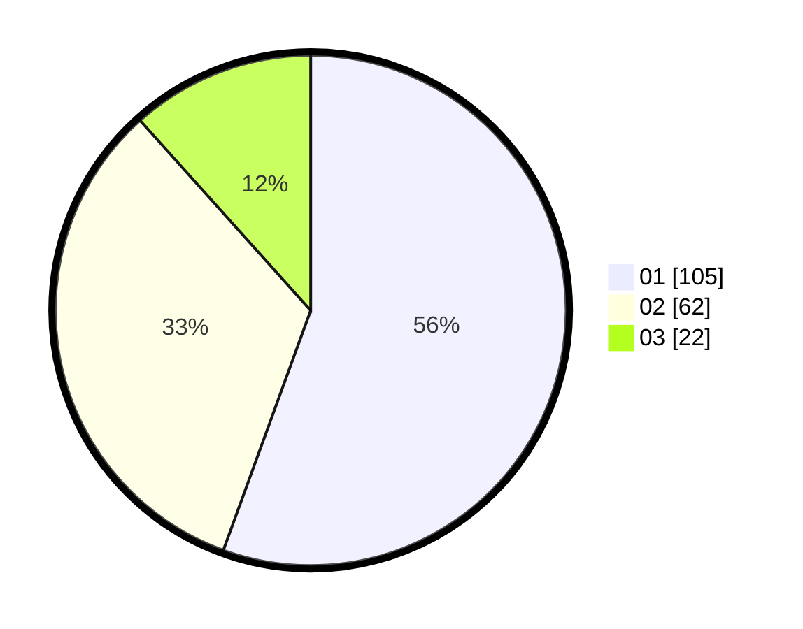

# Hasil

Hasil perolehan suara paslon dapat dilihat pada file paslon-01.txt, paslon-02.txt, dan paslon-03.txt.

Jika tidak ada, artinya data tersebut belum ada pada SIREKAP.

## Perolehan Suara

 * Paslon 01: **105**.
 * Paslon 02: **62**.
 * Paslon 03: **22**.

## Foto C Plano

https://sirekap-obj-formc.kpu.go.id/9893/pemilu/ppwp/31/74/10/10/04/3174101004044-20240214-165242--be26ea41-d090-475d-97c3-8100b0ac7d42.jpg

https://sirekap-obj-formc.kpu.go.id/9893/pemilu/ppwp/31/74/10/10/04/3174101004044-20240214-165243--a6b8fe48-b96f-49cc-b821-4a5de3850ed6.jpg

https://sirekap-obj-formc.kpu.go.id/9893/pemilu/ppwp/31/74/10/10/04/3174101004044-20240214-165242--226c32e2-bbaf-4222-ab51-cadc9639908e.jpg

## DATA PEMILIH TETAP

Jumlah pemilih dalam DPT: **237**.
 * L: **118**.
 * P: **119**.

## DATA PENGGUNA HAK PILIH

Jumlah pengguna hak pilih dalam DPT: **189**.
 * L: **95**.
 * P: **94**.

Jumlah pengguna hak pilih dalam DPTb: **0**.
 * L: **0**.
 * P: **0**.

Jumlah pengguna hak pilih dalam DPK: **1**.
 * L: **0**.
 * P: **1**.

Jumlah pengguna hak pilih: **190**.
 * L: **95**.
 * P: **95**.

## JUMLAH SUARA SAH DAN TIDAK SAH

JUMLAH SELURUH SUARA SAH: **189**.

JUMLAH SUARA TIDAK SAH: **1**.

JUMLAH SELURUH SUARA SAH DAN SUARA TIDAK SAH: **190**.
