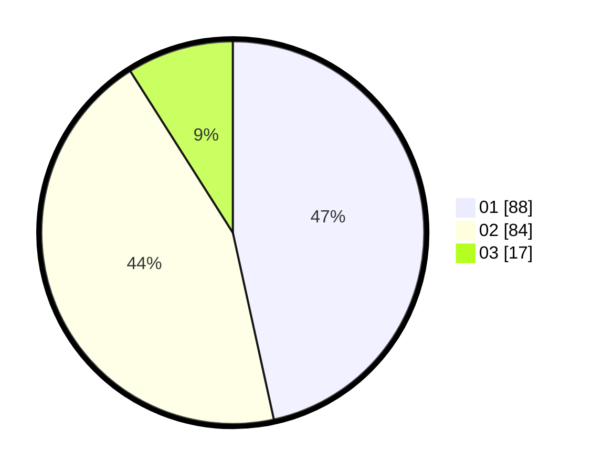

# Hasil

Hasil perolehan suara paslon dapat dilihat pada file paslon-01.txt, paslon-02.txt, dan paslon-03.txt.

Jika tidak ada, artinya data tersebut belum ada pada SIREKAP.

## Perolehan Suara

 * Paslon 01: **88**.
 * Paslon 02: **84**.
 * Paslon 03: **17**.

## Foto C Plano

https://sirekap-obj-formc.kpu.go.id/0366/pemilu/ppwp/31/74/10/10/04/3174101004045-20240214-155057--841194ae-edb6-4213-b791-70ec75d4177c.jpg

https://sirekap-obj-formc.kpu.go.id/0366/pemilu/ppwp/31/74/10/10/04/3174101004045-20240214-192112--d3510dbe-6048-4ccb-aaf1-320868ed5088.jpg

https://sirekap-obj-formc.kpu.go.id/0366/pemilu/ppwp/31/74/10/10/04/3174101004045-20240214-191323--8307f9f7-dbfe-4e79-84ec-dd523b63832f.jpg

## DATA PEMILIH TETAP

Jumlah pemilih dalam DPT: **236**.
 * L: **115**.
 * P: **121**.

## DATA PENGGUNA HAK PILIH

Jumlah pengguna hak pilih dalam DPT: **188**.
 * L: **93**.
 * P: **95**.

Jumlah pengguna hak pilih dalam DPTb: **1**.
 * L: **1**.
 * P: **0**.

Jumlah pengguna hak pilih dalam DPK: **3**.
 * L: **2**.
 * P: **1**.

Jumlah pengguna hak pilih: **192**.
 * L: **96**.
 * P: **96**.

## JUMLAH SUARA SAH DAN TIDAK SAH

JUMLAH SELURUH SUARA SAH: **189**.

JUMLAH SUARA TIDAK SAH: **3**.

JUMLAH SELURUH SUARA SAH DAN SUARA TIDAK SAH: **192**.
