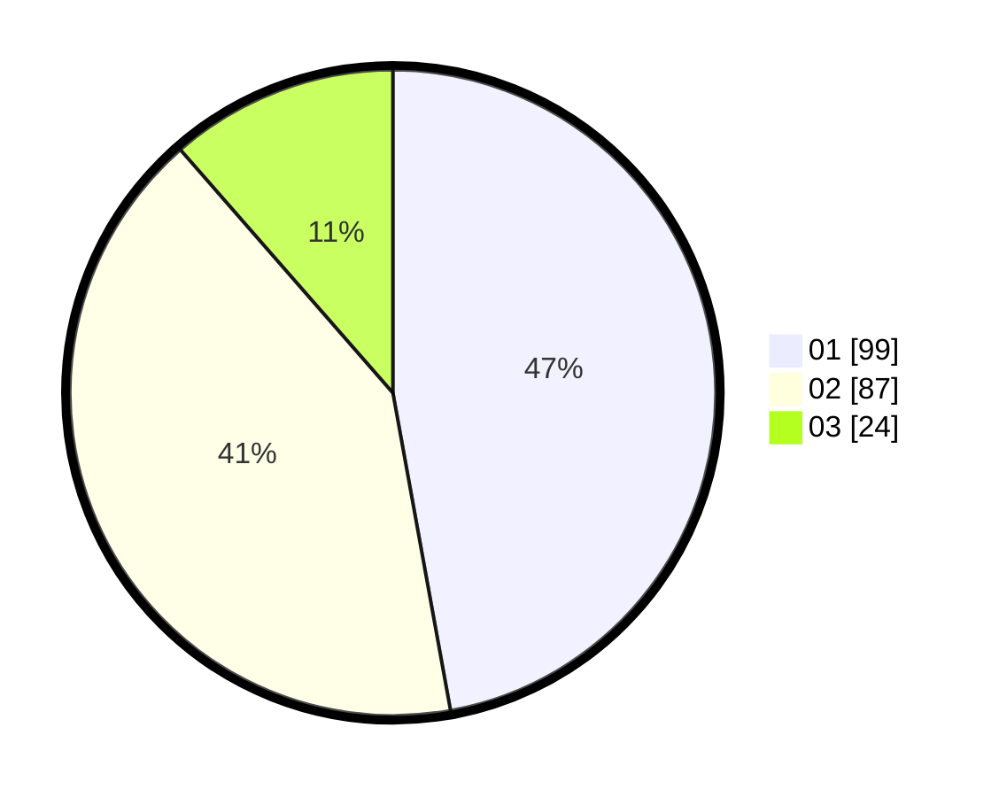

# Hasil

Hasil perolehan suara paslon dapat dilihat pada file paslon-01.txt, paslon-02.txt, dan paslon-03.txt.

Jika tidak ada, artinya data tersebut belum ada pada SIREKAP.

## Perolehan Suara

 * Paslon 01: **99**.
 * Paslon 02: **87**.
 * Paslon 03: **24**.

## Foto C Plano

https://sirekap-obj-formc.kpu.go.id/81ba/pemilu/ppwp/31/74/10/10/04/3174101004057-20240214-232918--dd9bc4ae-2a56-4001-ab24-9f6ff13ed75e.jpg

https://sirekap-obj-formc.kpu.go.id/81ba/pemilu/ppwp/31/74/10/10/04/3174101004057-20240214-232955--786d4331-90b8-419d-893d-329c8431f5e4.jpg

https://sirekap-obj-formc.kpu.go.id/81ba/pemilu/ppwp/31/74/10/10/04/3174101004057-20240214-233025--d2096149-6ef0-42bd-baac-62811e202b52.jpg
