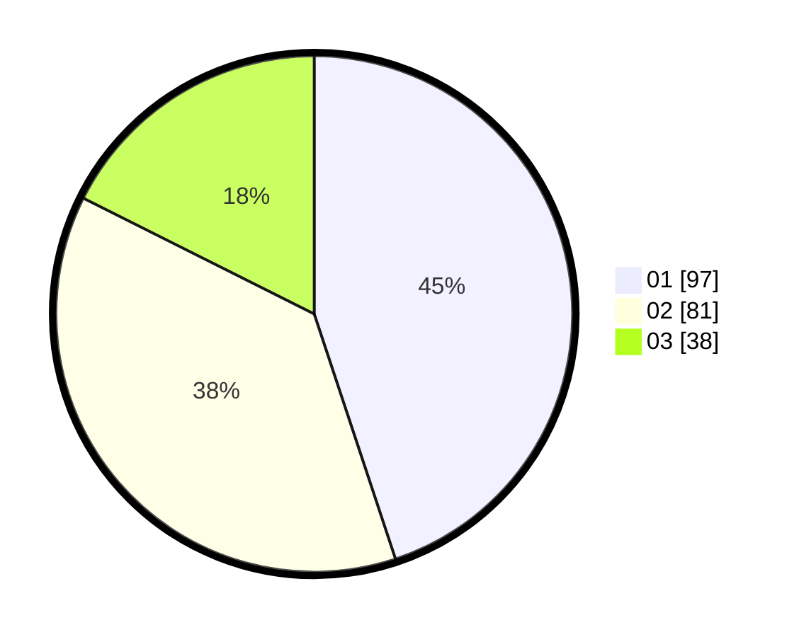

# Hasil

Hasil perolehan suara paslon dapat dilihat pada file paslon-01.txt, paslon-02.txt, dan paslon-03.txt.

Jika tidak ada, artinya data tersebut belum ada pada SIREKAP.

## Perolehan Suara

 * Paslon 01: **97**.
 * Paslon 02: **81**.
 * Paslon 03: **38**.

## Foto C Plano

https://sirekap-obj-formc.kpu.go.id/c753/pemilu/ppwp/31/74/10/10/04/3174101004071-20240214-194130--cd12a89d-b8f0-4d48-90b2-d53eb3408b4c.jpg

https://sirekap-obj-formc.kpu.go.id/c753/pemilu/ppwp/31/74/10/10/04/3174101004071-20240214-194134--fe77e645-9ad1-4849-a59e-98c9f42dc61d.jpg

https://sirekap-obj-formc.kpu.go.id/c753/pemilu/ppwp/31/74/10/10/04/3174101004071-20240214-194145--df848a3f-94c0-430b-b6a9-309d57c08e0f.jpg

## DATA PEMILIH TETAP

Jumlah pemilih dalam DPT: **300**.
 * L: **146**.
 * P: **154**.

## DATA PENGGUNA HAK PILIH

Jumlah pengguna hak pilih dalam DPT: **218**.
 * L: **99**.
 * P: **119**.

Jumlah pengguna hak pilih dalam DPTb: **0**.
 * L: **0**.
 * P: **0**.

Jumlah pengguna hak pilih dalam DPK: **1**.
 * L: **0**.
 * P: **1**.

Jumlah pengguna hak pilih: **219**.
 * L: **99**.
 * P: **120**.

## JUMLAH SUARA SAH DAN TIDAK SAH

JUMLAH SELURUH SUARA SAH: **216**.

JUMLAH SUARA TIDAK SAH: **3**.

JUMLAH SELURUH SUARA SAH DAN SUARA TIDAK SAH: **219**.
