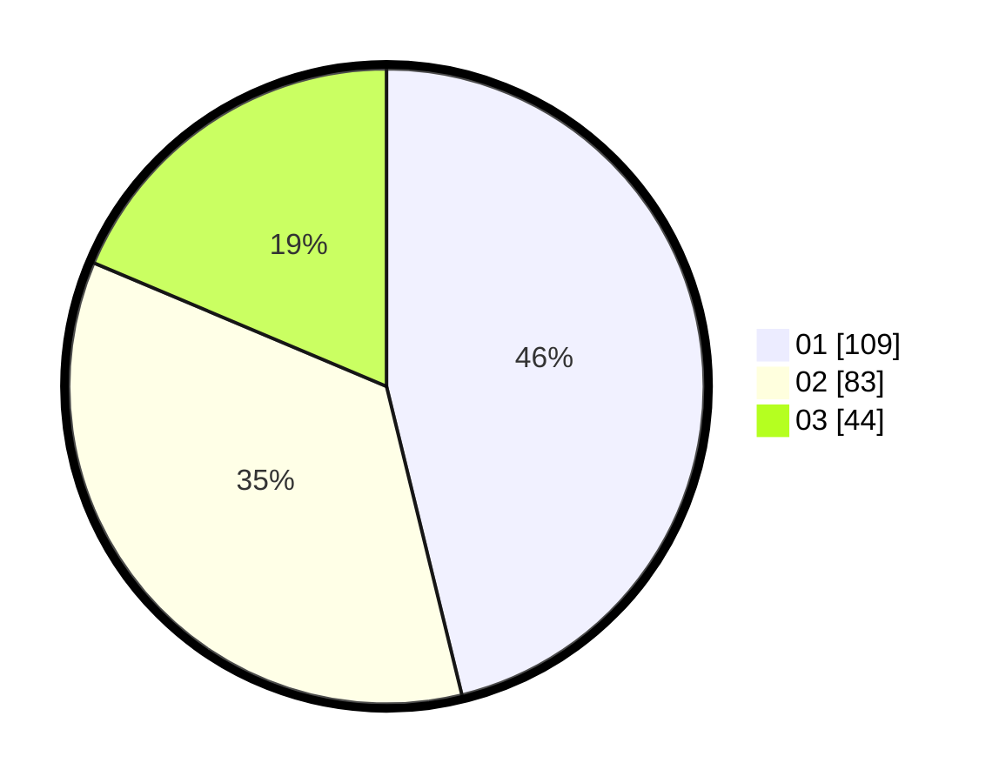

# Hasil

Hasil perolehan suara paslon dapat dilihat pada file paslon-01.txt, paslon-02.txt, dan paslon-03.txt.

Jika tidak ada, artinya data tersebut belum ada pada SIREKAP.

## Perolehan Suara

 * Paslon 01: **109**.
 * Paslon 02: **83**.
 * Paslon 03: **44**.

## Foto C Plano

https://sirekap-obj-formc.kpu.go.id/8ec0/pemilu/ppwp/31/74/10/10/04/3174101004092-20240214-202605--e90d638b-e7fe-41ac-8102-08dc719711c3.jpg

https://sirekap-obj-formc.kpu.go.id/8ec0/pemilu/ppwp/31/74/10/10/04/3174101004092-20240214-202712--85971e68-4683-4d21-b1b9-32f07fbd276d.jpg

https://sirekap-obj-formc.kpu.go.id/8ec0/pemilu/ppwp/31/74/10/10/04/3174101004092-20240214-202809--03d366b9-dbe5-4df2-a029-41ddd23ecde9.jpg

## DATA PEMILIH TETAP

Jumlah pemilih dalam DPT: **292**.
 * L: **140**.
 * P: **152**.

## DATA PENGGUNA HAK PILIH

Jumlah pengguna hak pilih dalam DPT: **234**.
 * L: **108**.
 * P: **126**.

Jumlah pengguna hak pilih dalam DPTb: **4**.
 * L: **2**.
 * P: **2**.

Jumlah pengguna hak pilih dalam DPK: **2**.
 * L: **1**.
 * P: **1**.

Jumlah pengguna hak pilih: **240**.
 * L: **111**.
 * P: **129**.

## JUMLAH SUARA SAH DAN TIDAK SAH

JUMLAH SELURUH SUARA SAH: **236**.

JUMLAH SUARA TIDAK SAH: **4**.

JUMLAH SELURUH SUARA SAH DAN SUARA TIDAK SAH: **240**.
