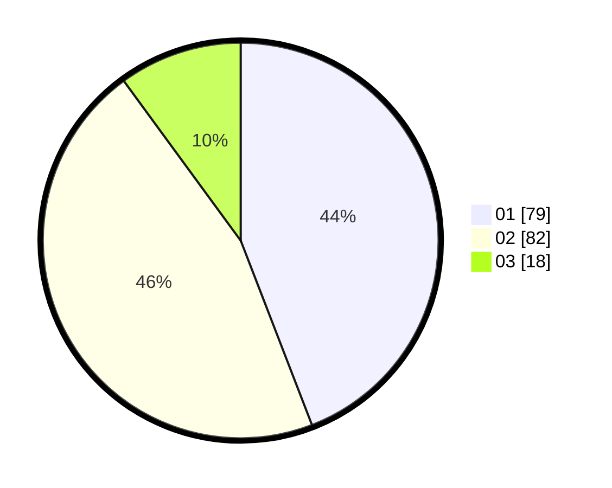

# Hasil

Hasil perolehan suara paslon dapat dilihat pada file paslon-01.txt, paslon-02.txt, dan paslon-03.txt.

Jika tidak ada, artinya data tersebut belum ada pada SIREKAP.

## Perolehan Suara

 * Paslon 01: **79**.
 * Paslon 02: **82**.
 * Paslon 03: **18**.

## Foto C Plano

https://sirekap-obj-formc.kpu.go.id/a31f/pemilu/ppwp/31/74/10/10/04/3174101004112-20240214-211030--58e46f3e-4044-4032-974f-f7e656f4a971.jpg

https://sirekap-obj-formc.kpu.go.id/a31f/pemilu/ppwp/31/74/10/10/04/3174101004112-20240214-210812--549dd5fc-e570-4286-b23f-f33fcffd0867.jpg

https://sirekap-obj-formc.kpu.go.id/a31f/pemilu/ppwp/31/74/10/10/04/3174101004112-20240214-211158--7eb0b20b-e945-4634-a638-8994abfaca94.jpg

## DATA PEMILIH TETAP

Jumlah pemilih dalam DPT: **242**.
 * L: **179**.
 * P: **123**.

## DATA PENGGUNA HAK PILIH

Jumlah pengguna hak pilih dalam DPT: **184**.
 * L: **90**.
 * P: **94**.

Jumlah pengguna hak pilih dalam DPTb: **0**.
 * L: **0**.
 * P: **0**.

Jumlah pengguna hak pilih dalam DPK: **0**.
 * L: **0**.
 * P: **0**.

Jumlah pengguna hak pilih: **184**.
 * L: **90**.
 * P: **94**.

## JUMLAH SUARA SAH DAN TIDAK SAH

JUMLAH SELURUH SUARA SAH: **179**.

JUMLAH SUARA TIDAK SAH: **5**.

JUMLAH SELURUH SUARA SAH DAN SUARA TIDAK SAH: **184**.
