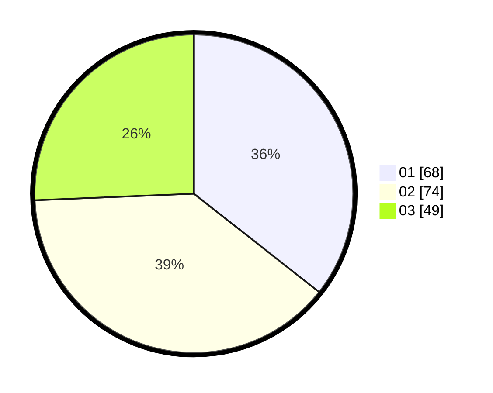

# Hasil

Hasil perolehan suara paslon dapat dilihat pada file paslon-01.txt, paslon-02.txt, dan paslon-03.txt.

Jika tidak ada, artinya data tersebut belum ada pada SIREKAP.

## Perolehan Suara

 * Paslon 01: **68**.
 * Paslon 02: **74**.
 * Paslon 03: **49**.

## Foto C Plano

https://sirekap-obj-formc.kpu.go.id/ab2c/pemilu/ppwp/31/74/10/10/04/3174101004113-20240214-212248--22182840-19f3-4723-8871-0f9fdb32f7a8.jpg

https://sirekap-obj-formc.kpu.go.id/ab2c/pemilu/ppwp/31/74/10/10/04/3174101004113-20240214-212813--5f73ac7d-73f1-4cdb-8f78-2618ae77b4a6.jpg

https://sirekap-obj-formc.kpu.go.id/ab2c/pemilu/ppwp/31/74/10/10/04/3174101004113-20240214-213002--602212bb-1a2b-4fdb-816d-d0c47d2be337.jpg

## DATA PEMILIH TETAP

Jumlah pemilih dalam DPT: **266**.
 * L: **132**.
 * P: **134**.

## DATA PENGGUNA HAK PILIH

Jumlah pengguna hak pilih dalam DPT: **186**.
 * L: **89**.
 * P: **97**.

Jumlah pengguna hak pilih dalam DPTb: **1**.
 * L: **0**.
 * P: **1**.

Jumlah pengguna hak pilih dalam DPK: **4**.
 * L: **3**.
 * P: **1**.

Jumlah pengguna hak pilih: **191**.
 * L: **92**.
 * P: **99**.

## JUMLAH SUARA SAH DAN TIDAK SAH

JUMLAH SELURUH SUARA SAH: **191**.

JUMLAH SUARA TIDAK SAH: **0**.

JUMLAH SELURUH SUARA SAH DAN SUARA TIDAK SAH: **191**.
