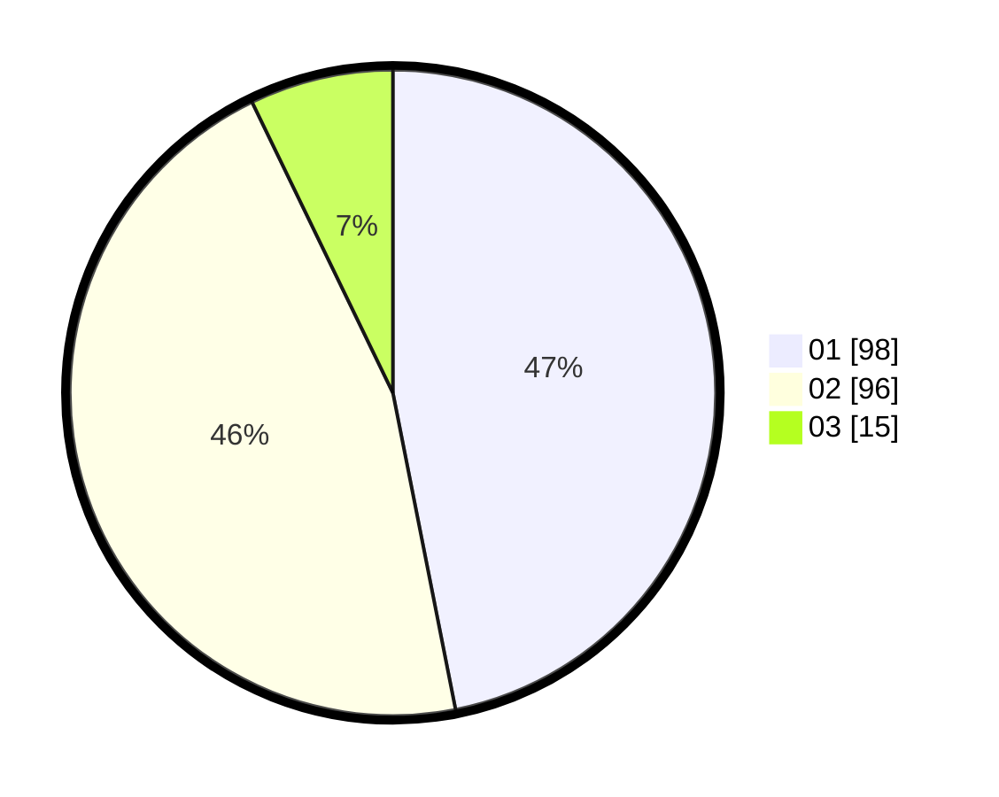

# Hasil

Hasil perolehan suara paslon dapat dilihat pada file paslon-01.txt, paslon-02.txt, dan paslon-03.txt.

Jika tidak ada, artinya data tersebut belum ada pada SIREKAP.

## Perolehan Suara

 * Paslon 01: **98**.
 * Paslon 02: **96**.
 * Paslon 03: **15**.

## Foto C Plano

https://sirekap-obj-formc.kpu.go.id/e3d8/pemilu/ppwp/31/74/10/10/04/3174101004119-20240214-213739--9822ed98-2ad4-41de-9745-ca878de95f2c.jpg

https://sirekap-obj-formc.kpu.go.id/e3d8/pemilu/ppwp/31/74/10/10/04/3174101004119-20240214-213910--58a04949-d1ee-42c5-9f7e-6edd1904bd81.jpg

https://sirekap-obj-formc.kpu.go.id/e3d8/pemilu/ppwp/31/74/10/10/04/3174101004119-20240214-214038--3cd7da65-fd6c-41a5-b1df-b37118646872.jpg
