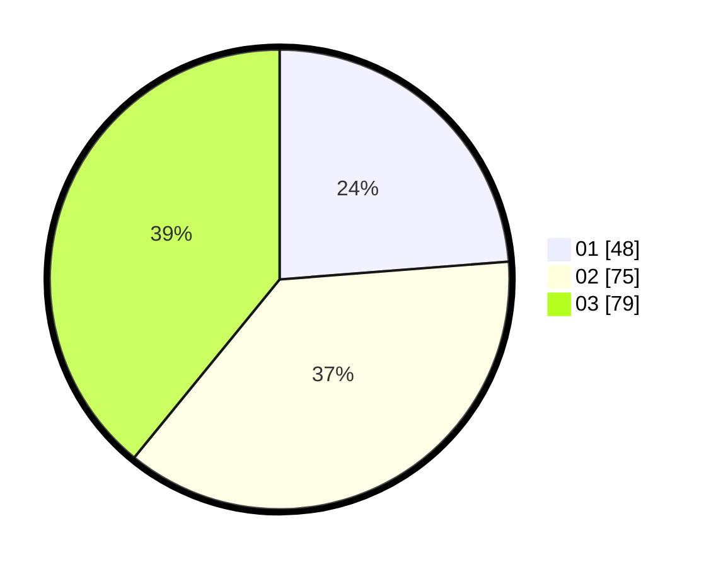

# Hasil

Hasil perolehan suara paslon dapat dilihat pada file paslon-01.txt, paslon-02.txt, dan paslon-03.txt.

Jika tidak ada, artinya data tersebut belum ada pada SIREKAP.

## Perolehan Suara

 * Paslon 01: **48**.
 * Paslon 02: **75**.
 * Paslon 03: **79**.

## Foto C Plano

https://sirekap-obj-formc.kpu.go.id/402d/pemilu/ppwp/31/74/10/10/04/3174101004123-20240214-221115--be89ad0e-5b88-4db4-aef6-459f8528d0dd.jpg

https://sirekap-obj-formc.kpu.go.id/402d/pemilu/ppwp/31/74/10/10/04/3174101004123-20240214-221219--9e5d0098-0dd2-4a6c-b9f0-d61007178731.jpg

https://sirekap-obj-formc.kpu.go.id/402d/pemilu/ppwp/31/74/10/10/04/3174101004123-20240214-221308--23b0c89d-0e2e-4080-9964-3cec88be2f60.jpg
