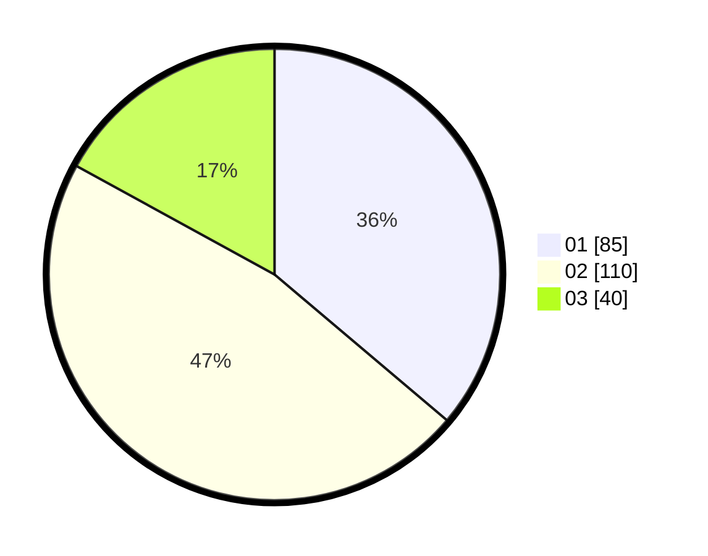

# Hasil

Hasil perolehan suara paslon dapat dilihat pada file paslon-01.txt, paslon-02.txt, dan paslon-03.txt.

Jika tidak ada, artinya data tersebut belum ada pada SIREKAP.

## Perolehan Suara

 * Paslon 01: **85**.
 * Paslon 02: **110**.
 * Paslon 03: **40**.

## Foto C Plano

https://sirekap-obj-formc.kpu.go.id/428e/pemilu/ppwp/31/74/10/10/05/3174101005003-20240214-231412--21f82ab9-b285-42d8-9560-a55aa2cf36f6.jpg

https://sirekap-obj-formc.kpu.go.id/428e/pemilu/ppwp/31/74/10/10/05/3174101005003-20240214-204814--2efd1713-0ec8-4be5-b588-004bf69bbecf.jpg

https://sirekap-obj-formc.kpu.go.id/428e/pemilu/ppwp/31/74/10/10/05/3174101005003-20240214-204856--06c90146-e7c6-4349-9e0c-a201e5f552bc.jpg

## DATA PEMILIH TETAP

Jumlah pemilih dalam DPT: **272**.
 * L: **139**.
 * P: **133**.

## DATA PENGGUNA HAK PILIH

Jumlah pengguna hak pilih dalam DPT: **235**.
 * L: **117**.
 * P: **118**.

Jumlah pengguna hak pilih dalam DPTb: **3**.
 * L: **1**.
 * P: **2**.

Jumlah pengguna hak pilih dalam DPK: **0**.
 * L: **0**.
 * P: **0**.

Jumlah pengguna hak pilih: **238**.
 * L: **118**.
 * P: **120**.

## JUMLAH SUARA SAH DAN TIDAK SAH

JUMLAH SELURUH SUARA SAH: **235**.

JUMLAH SUARA TIDAK SAH: **3**.

JUMLAH SELURUH SUARA SAH DAN SUARA TIDAK SAH: **238**.
