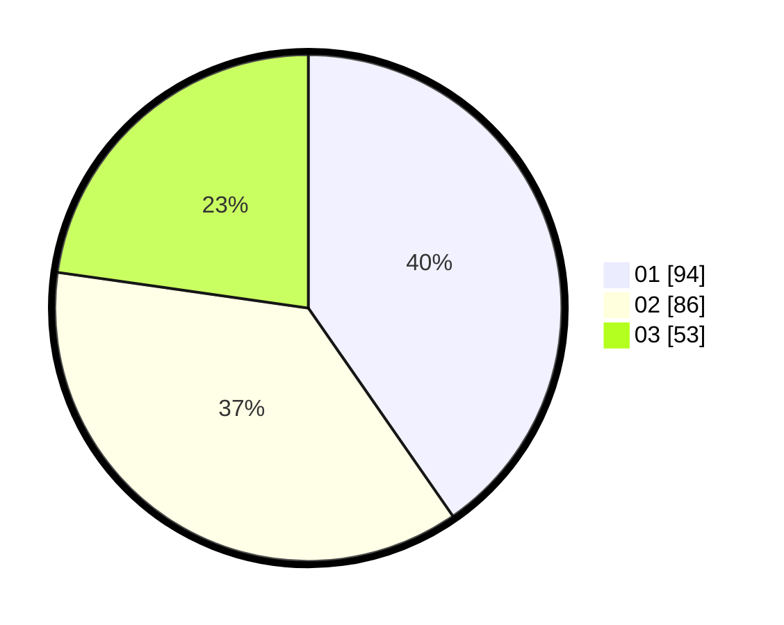

# Hasil

Hasil perolehan suara paslon dapat dilihat pada file paslon-01.txt, paslon-02.txt, dan paslon-03.txt.

Jika tidak ada, artinya data tersebut belum ada pada SIREKAP.

## Perolehan Suara

 * Paslon 01: **94**.
 * Paslon 02: **86**.
 * Paslon 03: **53**.

## Foto C Plano

https://sirekap-obj-formc.kpu.go.id/a9c1/pemilu/ppwp/31/74/10/10/05/3174101005007-20240214-204916--b73b60eb-a23b-4330-bb48-31a7d6466ca3.jpg

https://sirekap-obj-formc.kpu.go.id/a9c1/pemilu/ppwp/31/74/10/10/05/3174101005007-20240214-205250--46330fa5-edff-4449-97e2-aef9af2b8636.jpg

https://sirekap-obj-formc.kpu.go.id/a9c1/pemilu/ppwp/31/74/10/10/05/3174101005007-20240214-205408--14e794d4-c9c6-4bac-9eac-b525ce0f573c.jpg

## DATA PEMILIH TETAP

Jumlah pemilih dalam DPT: **272**.
 * L: **132**.
 * P: **140**.

## DATA PENGGUNA HAK PILIH

Jumlah pengguna hak pilih dalam DPT: **232**.
 * L: **110**.
 * P: **122**.

Jumlah pengguna hak pilih dalam DPTb: **3**.
 * L: **2**.
 * P: **1**.

Jumlah pengguna hak pilih dalam DPK: **1**.
 * L: **1**.
 * P: **0**.

Jumlah pengguna hak pilih: **236**.
 * L: **113**.
 * P: **123**.

## JUMLAH SUARA SAH DAN TIDAK SAH

JUMLAH SELURUH SUARA SAH: **233**.

JUMLAH SUARA TIDAK SAH: **3**.

JUMLAH SELURUH SUARA SAH DAN SUARA TIDAK SAH: **236**.
