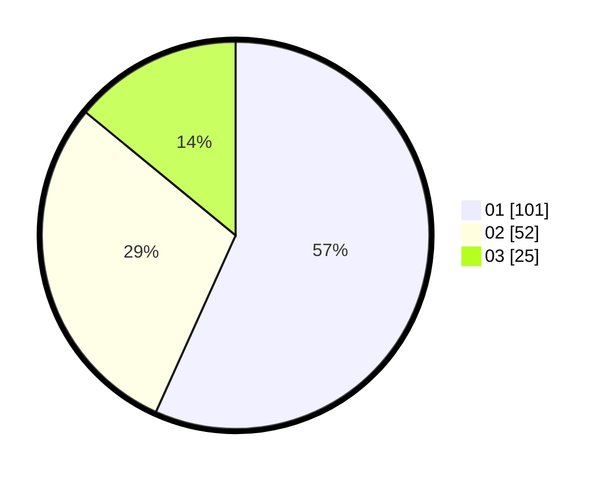

# Hasil

Hasil perolehan suara paslon dapat dilihat pada file paslon-01.txt, paslon-02.txt, dan paslon-03.txt.

Jika tidak ada, artinya data tersebut belum ada pada SIREKAP.

## Perolehan Suara

 * Paslon 01: **101**.
 * Paslon 02: **52**.
 * Paslon 03: **25**.

## Foto C Plano

https://sirekap-obj-formc.kpu.go.id/9eea/pemilu/ppwp/31/74/10/10/05/3174101005011-20240218-210428--f2d653f6-0253-43ce-9e82-4bcd60e4aaa2.jpg

https://sirekap-obj-formc.kpu.go.id/9eea/pemilu/ppwp/31/74/10/10/05/3174101005011-20240218-210429--75cfee92-be96-47a3-8ec2-b591f0497deb.jpg

https://sirekap-obj-formc.kpu.go.id/9eea/pemilu/ppwp/31/74/10/10/05/3174101005011-20240218-210429--6934a65b-d728-47f8-9b44-082692384287.jpg

## DATA PEMILIH TETAP

Jumlah pemilih dalam DPT: **228**.
 * L: **115**.
 * P: **1132**.

## DATA PENGGUNA HAK PILIH

Jumlah pengguna hak pilih dalam DPT: **180**.
 * L: **89**.
 * P: **91**.

Jumlah pengguna hak pilih dalam DPTb: **0**.
 * L: **0**.
 * P: **0**.

Jumlah pengguna hak pilih dalam DPK: **4**.
 * L: **2**.
 * P: **2**.

Jumlah pengguna hak pilih: **184**.
 * L: **91**.
 * P: **93**.

## JUMLAH SUARA SAH DAN TIDAK SAH

JUMLAH SELURUH SUARA SAH: **178**.

JUMLAH SUARA TIDAK SAH: **6**.

JUMLAH SELURUH SUARA SAH DAN SUARA TIDAK SAH: **184**.
