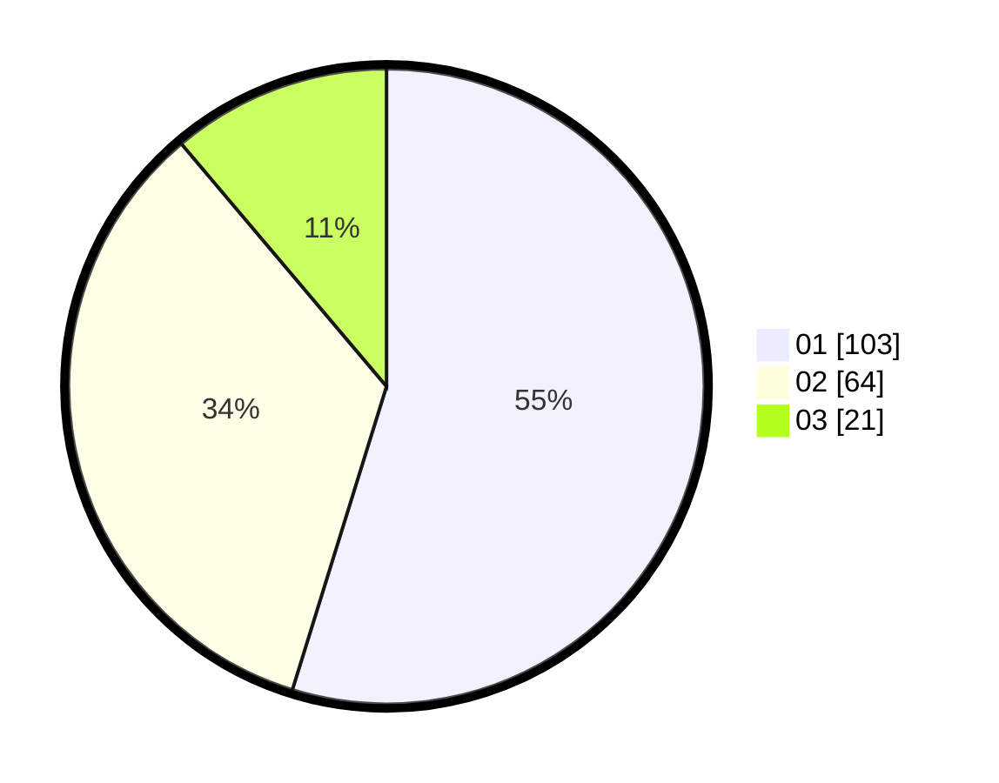

# Hasil

Hasil perolehan suara paslon dapat dilihat pada file paslon-01.txt, paslon-02.txt, dan paslon-03.txt.

Jika tidak ada, artinya data tersebut belum ada pada SIREKAP.

## Perolehan Suara

 * Paslon 01: **103**.
 * Paslon 02: **64**.
 * Paslon 03: **21**.

## Foto C Plano

https://sirekap-obj-formc.kpu.go.id/dc60/pemilu/ppwp/31/74/10/10/05/3174101005013-20240218-125540--10e51941-0ed0-4a6c-9bcf-0f7f3e3404b4.jpg

https://sirekap-obj-formc.kpu.go.id/dc60/pemilu/ppwp/31/74/10/10/05/3174101005013-20240218-125541--7ad602d0-8517-4ee7-b788-70d4d37e4d9b.jpg

https://sirekap-obj-formc.kpu.go.id/dc60/pemilu/ppwp/31/74/10/10/05/3174101005013-20240218-125541--e3e201c4-4ec8-4723-b7d6-24048fb61f86.jpg

## DATA PEMILIH TETAP

Jumlah pemilih dalam DPT: **237**.
 * L: **119**.
 * P: **118**.

## DATA PENGGUNA HAK PILIH

Jumlah pengguna hak pilih dalam DPT: **187**.
 * L: **94**.
 * P: **93**.

Jumlah pengguna hak pilih dalam DPTb: **5**.
 * L: **2**.
 * P: **3**.

Jumlah pengguna hak pilih dalam DPK: **0**.
 * L: **0**.
 * P: **0**.

Jumlah pengguna hak pilih: **192**.
 * L: **96**.
 * P: **96**.

## JUMLAH SUARA SAH DAN TIDAK SAH

JUMLAH SELURUH SUARA SAH: **188**.

JUMLAH SUARA TIDAK SAH: **4**.

JUMLAH SELURUH SUARA SAH DAN SUARA TIDAK SAH: **192**.
