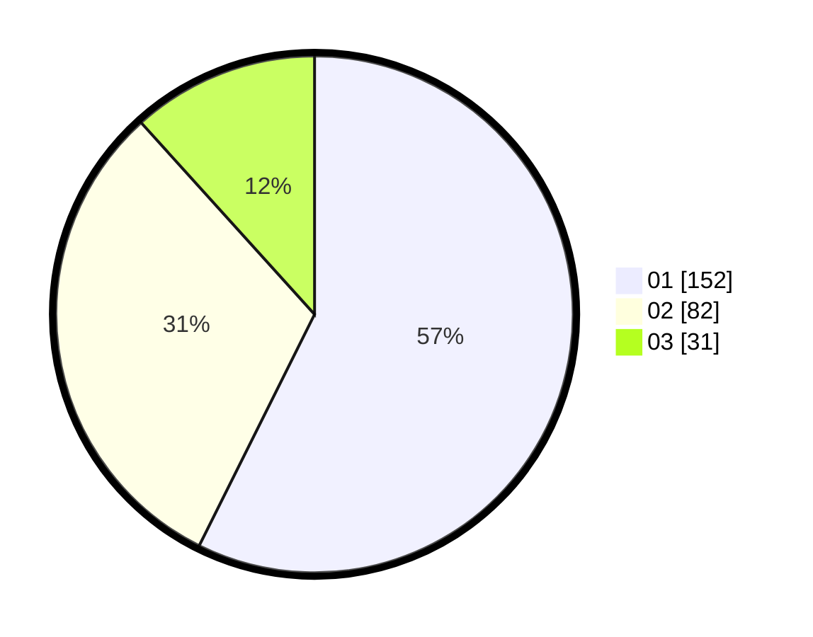

# Hasil

Hasil perolehan suara paslon dapat dilihat pada file paslon-01.txt, paslon-02.txt, dan paslon-03.txt.

Jika tidak ada, artinya data tersebut belum ada pada SIREKAP.

## Perolehan Suara

 * Paslon 01: **152**.
 * Paslon 02: **82**.
 * Paslon 03: **31**.

## Foto C Plano

https://sirekap-obj-formc.kpu.go.id/39c5/pemilu/ppwp/31/74/10/10/05/3174101005022-20240214-155142--0392618d-8205-4ab2-b712-270d46d88ad4.jpg

https://sirekap-obj-formc.kpu.go.id/39c5/pemilu/ppwp/31/74/10/10/05/3174101005022-20240214-155306--ca071938-90af-41e8-ab96-e9439589b052.jpg

https://sirekap-obj-formc.kpu.go.id/39c5/pemilu/ppwp/31/74/10/10/05/3174101005022-20240214-155353--ef532491-8a1a-4bb7-ab88-b3c20de21ba9.jpg

## DATA PEMILIH TETAP

Jumlah pemilih dalam DPT: **283**.
 * L: **136**.
 * P: **147**.

## DATA PENGGUNA HAK PILIH

Jumlah pengguna hak pilih dalam DPT: **247**.
 * L: **116**.
 * P: **131**.

Jumlah pengguna hak pilih dalam DPTb: **21**.
 * L: **3**.
 * P: **18**.

Jumlah pengguna hak pilih dalam DPK: **1**.
 * L: **1**.
 * P: **0**.

Jumlah pengguna hak pilih: **269**.
 * L: **120**.
 * P: **149**.

## JUMLAH SUARA SAH DAN TIDAK SAH

JUMLAH SELURUH SUARA SAH: **265**.

JUMLAH SUARA TIDAK SAH: **4**.

JUMLAH SELURUH SUARA SAH DAN SUARA TIDAK SAH: **269**.
