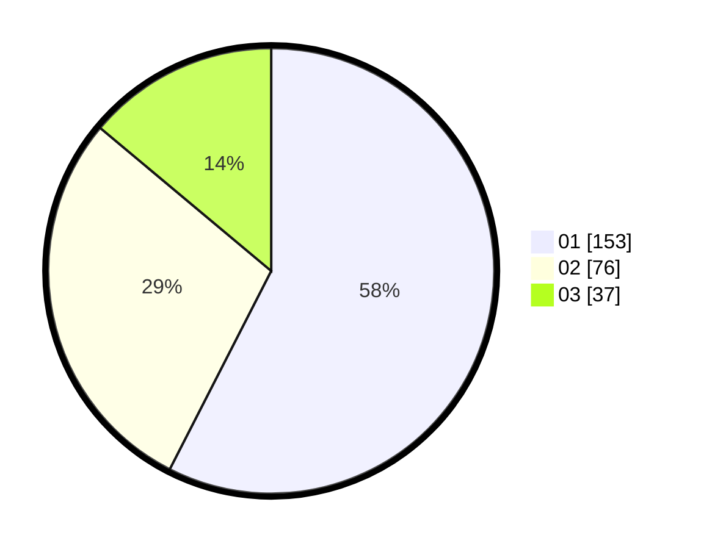

# Hasil

Hasil perolehan suara paslon dapat dilihat pada file paslon-01.txt, paslon-02.txt, dan paslon-03.txt.

Jika tidak ada, artinya data tersebut belum ada pada SIREKAP.

## Perolehan Suara

 * Paslon 01: **153**.
 * Paslon 02: **76**.
 * Paslon 03: **37**.

## Foto C Plano

https://sirekap-obj-formc.kpu.go.id/4de9/pemilu/ppwp/31/74/10/10/05/3174101005026-20240218-193041--1a808190-96a3-4fb8-9eaf-4473f7777631.jpg

https://sirekap-obj-formc.kpu.go.id/4de9/pemilu/ppwp/31/74/10/10/05/3174101005026-20240218-193857--a485303b-03dc-47fa-8e5f-d41c82972108.jpg

https://sirekap-obj-formc.kpu.go.id/4de9/pemilu/ppwp/31/74/10/10/05/3174101005026-20240218-193956--25660236-9f4f-44ac-9e77-7b8389551766.jpg

## DATA PEMILIH TETAP

Jumlah pemilih dalam DPT: **297**.
 * L: **131**.
 * P: **166**.

## DATA PENGGUNA HAK PILIH

Jumlah pengguna hak pilih dalam DPT: **252**.
 * L: **109**.
 * P: **143**.

Jumlah pengguna hak pilih dalam DPTb: **13**.
 * L: **2**.
 * P: **11**.

Jumlah pengguna hak pilih dalam DPK: **4**.
 * L: **1**.
 * P: **3**.

Jumlah pengguna hak pilih: **269**.
 * L: **112**.
 * P: **157**.

## JUMLAH SUARA SAH DAN TIDAK SAH

JUMLAH SELURUH SUARA SAH: **266**.

JUMLAH SUARA TIDAK SAH: **3**.

JUMLAH SELURUH SUARA SAH DAN SUARA TIDAK SAH: **269**.
