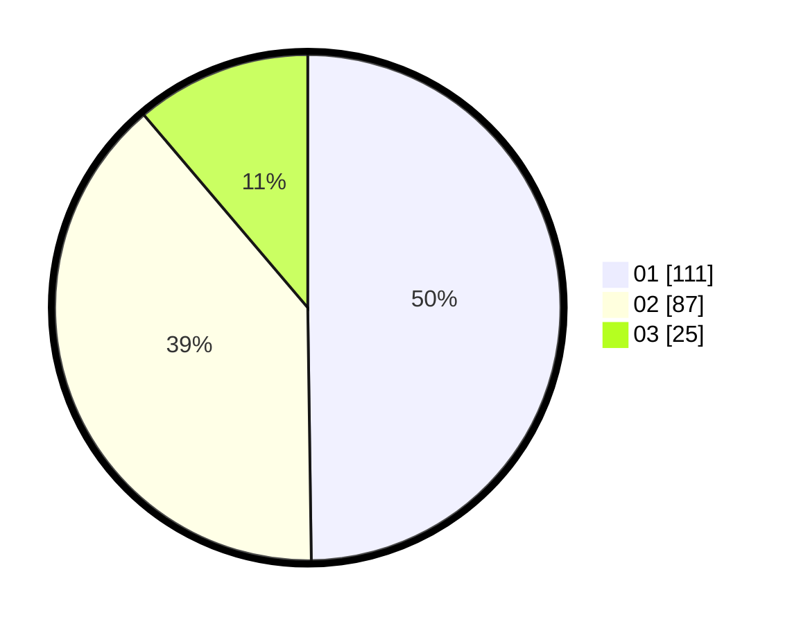

# Hasil

Hasil perolehan suara paslon dapat dilihat pada file paslon-01.txt, paslon-02.txt, dan paslon-03.txt.

Jika tidak ada, artinya data tersebut belum ada pada SIREKAP.

## Perolehan Suara

 * Paslon 01: **111**.
 * Paslon 02: **87**.
 * Paslon 03: **25**.

## Foto C Plano

https://sirekap-obj-formc.kpu.go.id/6028/pemilu/ppwp/31/74/10/10/05/3174101005032-20240216-203804--82a2a884-0be0-4315-9588-e98c87f35f39.jpg

https://sirekap-obj-formc.kpu.go.id/6028/pemilu/ppwp/31/74/10/10/05/3174101005032-20240216-203807--ecf985a5-0538-4fd2-b7d3-5be96191b50f.jpg

https://sirekap-obj-formc.kpu.go.id/6028/pemilu/ppwp/31/74/10/10/05/3174101005032-20240216-203805--715b27ee-a193-439b-804a-7b33eecc497a.jpg

## DATA PEMILIH TETAP

Jumlah pemilih dalam DPT: **287**.
 * L: **155**.
 * P: **132**.

## DATA PENGGUNA HAK PILIH

Jumlah pengguna hak pilih dalam DPT: **227**.
 * L: **119**.
 * P: **108**.

Jumlah pengguna hak pilih dalam DPTb: **0**.
 * L: **0**.
 * P: **0**.

Jumlah pengguna hak pilih dalam DPK: **0**.
 * L: **0**.
 * P: **0**.

Jumlah pengguna hak pilih: **227**.
 * L: **119**.
 * P: **108**.

## JUMLAH SUARA SAH DAN TIDAK SAH

JUMLAH SELURUH SUARA SAH: **223**.

JUMLAH SUARA TIDAK SAH: **4**.

JUMLAH SELURUH SUARA SAH DAN SUARA TIDAK SAH: **227**.
