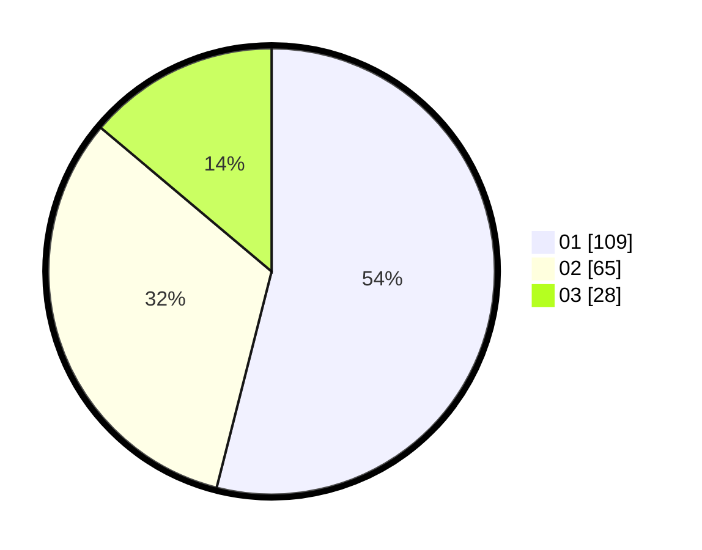

# Hasil

Hasil perolehan suara paslon dapat dilihat pada file paslon-01.txt, paslon-02.txt, dan paslon-03.txt.

Jika tidak ada, artinya data tersebut belum ada pada SIREKAP.

## Perolehan Suara

 * Paslon 01: **109**.
 * Paslon 02: **65**.
 * Paslon 03: **28**.

## Foto C Plano

https://sirekap-obj-formc.kpu.go.id/be0c/pemilu/ppwp/31/74/10/10/05/3174101005037-20240216-022109--99197d76-104c-4bf9-aef4-fa0c01ab5f51.jpg

https://sirekap-obj-formc.kpu.go.id/be0c/pemilu/ppwp/31/74/10/10/05/3174101005037-20240216-022120--1c5cfd5b-df11-446c-8e4f-c7f7fbd73742.jpg

https://sirekap-obj-formc.kpu.go.id/be0c/pemilu/ppwp/31/74/10/10/05/3174101005037-20240216-022112--c4f2bc9b-adde-4d91-b2eb-f318d33c965b.jpg

## DATA PEMILIH TETAP

Jumlah pemilih dalam DPT: **234**.
 * L: **103**.
 * P: **131**.

## DATA PENGGUNA HAK PILIH

Jumlah pengguna hak pilih dalam DPT: **198**.
 * L: **90**.
 * P: **108**.

Jumlah pengguna hak pilih dalam DPTb: **2**.
 * L: **0**.
 * P: **2**.

Jumlah pengguna hak pilih dalam DPK: **3**.
 * L: **1**.
 * P: **2**.

Jumlah pengguna hak pilih: **203**.
 * L: **91**.
 * P: **112**.

## JUMLAH SUARA SAH DAN TIDAK SAH

JUMLAH SELURUH SUARA SAH: **202**.

JUMLAH SUARA TIDAK SAH: **1**.

JUMLAH SELURUH SUARA SAH DAN SUARA TIDAK SAH: **203**.
