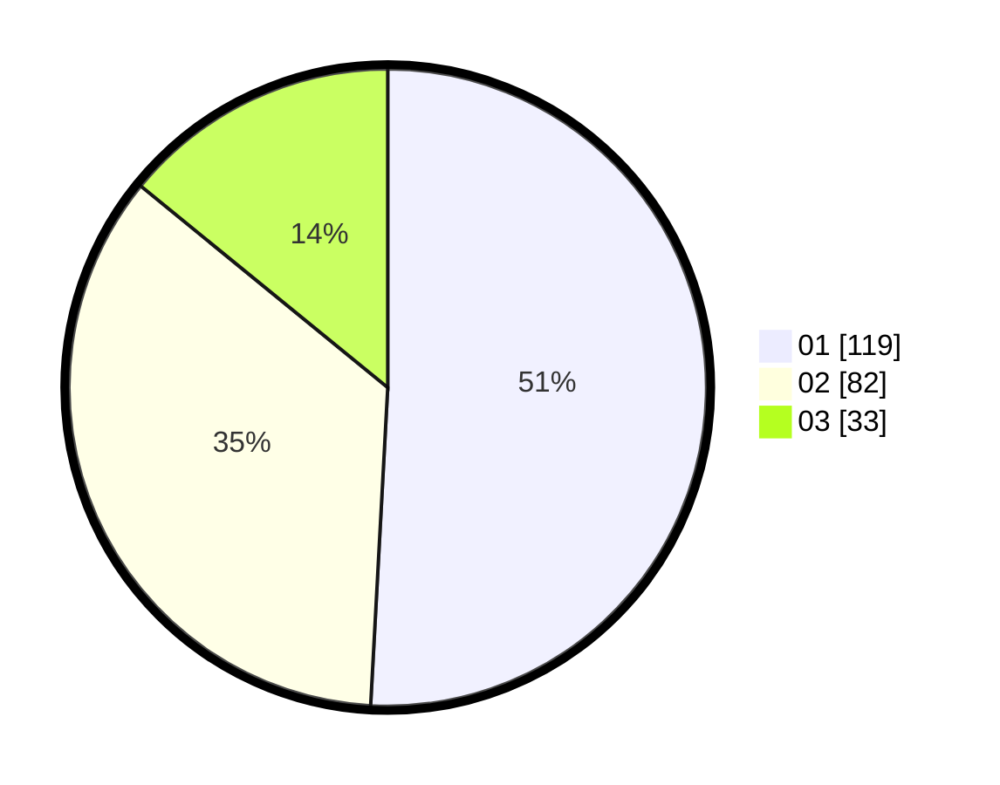

# Hasil

Hasil perolehan suara paslon dapat dilihat pada file paslon-01.txt, paslon-02.txt, dan paslon-03.txt.

Jika tidak ada, artinya data tersebut belum ada pada SIREKAP.

## Perolehan Suara

 * Paslon 01: **119**.
 * Paslon 02: **82**.
 * Paslon 03: **33**.

## Foto C Plano

https://sirekap-obj-formc.kpu.go.id/f667/pemilu/ppwp/31/74/10/10/05/3174101005040-20240216-134509--4615be5b-fb85-45b4-8524-61a1f1d44809.jpg

https://sirekap-obj-formc.kpu.go.id/f667/pemilu/ppwp/31/74/10/10/05/3174101005040-20240216-134510--fd335468-019e-4312-a757-73ea709edae3.jpg

https://sirekap-obj-formc.kpu.go.id/f667/pemilu/ppwp/31/74/10/10/05/3174101005040-20240216-134509--bc542d03-0177-4770-8cd4-d0ec8b0c848f.jpg

## DATA PEMILIH TETAP

Jumlah pemilih dalam DPT: **268**.
 * L: **138**.
 * P: **130**.

## DATA PENGGUNA HAK PILIH

Jumlah pengguna hak pilih dalam DPT: **222**.
 * L: **113**.
 * P: **109**.

Jumlah pengguna hak pilih dalam DPTb: **9**.
 * L: **1**.
 * P: **8**.

Jumlah pengguna hak pilih dalam DPK: **6**.
 * L: **3**.
 * P: **3**.

Jumlah pengguna hak pilih: **237**.
 * L: **117**.
 * P: **120**.

## JUMLAH SUARA SAH DAN TIDAK SAH

JUMLAH SELURUH SUARA SAH: **234**.

JUMLAH SUARA TIDAK SAH: **3**.

JUMLAH SELURUH SUARA SAH DAN SUARA TIDAK SAH: **237**.
