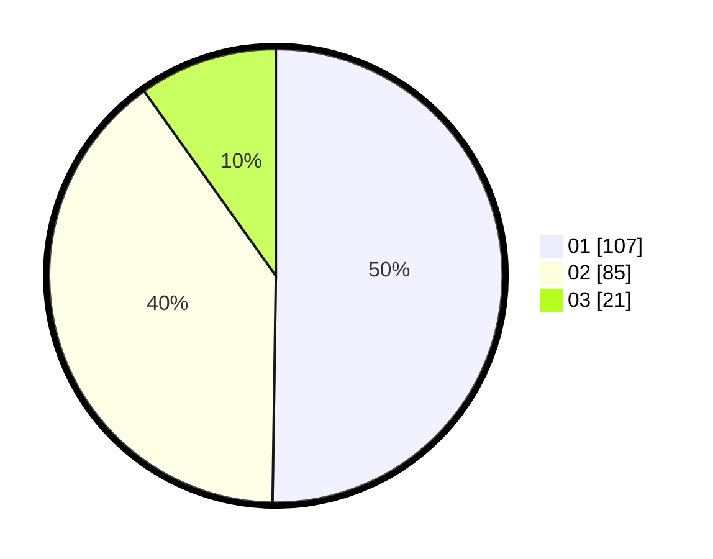

# Hasil

Hasil perolehan suara paslon dapat dilihat pada file paslon-01.txt, paslon-02.txt, dan paslon-03.txt.

Jika tidak ada, artinya data tersebut belum ada pada SIREKAP.

## Perolehan Suara

 * Paslon 01: **107**.
 * Paslon 02: **85**.
 * Paslon 03: **21**.

## Foto C Plano

https://sirekap-obj-formc.kpu.go.id/7082/pemilu/ppwp/31/74/10/10/05/3174101005046-20240216-195326--141f6b1f-60de-4219-8308-61768fcdd8f9.jpg

https://sirekap-obj-formc.kpu.go.id/7082/pemilu/ppwp/31/74/10/10/05/3174101005046-20240216-195327--e7b9006f-016d-4268-99c2-bc65545a0a06.jpg

https://sirekap-obj-formc.kpu.go.id/7082/pemilu/ppwp/31/74/10/10/05/3174101005046-20240216-195327--2ca63849-ebc2-4b12-a6e9-beedcce0144c.jpg

## DATA PEMILIH TETAP

Jumlah pemilih dalam DPT: **256**.
 * L: **120**.
 * P: **136**.

## DATA PENGGUNA HAK PILIH

Jumlah pengguna hak pilih dalam DPT: **212**.
 * L: **99**.
 * P: **113**.

Jumlah pengguna hak pilih dalam DPTb: **1**.
 * L: **1**.
 * P: **0**.

Jumlah pengguna hak pilih dalam DPK: **1**.
 * L: **0**.
 * P: **1**.

Jumlah pengguna hak pilih: **214**.
 * L: **100**.
 * P: **114**.

## JUMLAH SUARA SAH DAN TIDAK SAH

JUMLAH SELURUH SUARA SAH: **213**.

JUMLAH SUARA TIDAK SAH: **1**.

JUMLAH SELURUH SUARA SAH DAN SUARA TIDAK SAH: **214**.
