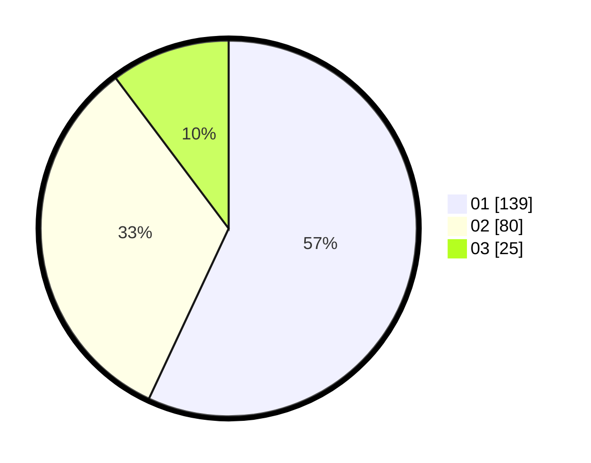

# Hasil

Hasil perolehan suara paslon dapat dilihat pada file paslon-01.txt, paslon-02.txt, dan paslon-03.txt.

Jika tidak ada, artinya data tersebut belum ada pada SIREKAP.

## Perolehan Suara

 * Paslon 01: **139**.
 * Paslon 02: **80**.
 * Paslon 03: **25**.

## Foto C Plano

https://sirekap-obj-formc.kpu.go.id/b264/pemilu/ppwp/31/74/10/10/05/3174101005059-20240216-223053--5bc32657-f58c-400d-9016-2a21b75a97b6.jpg

https://sirekap-obj-formc.kpu.go.id/b264/pemilu/ppwp/31/74/10/10/05/3174101005059-20240214-195032--26fecd71-f489-4669-9edf-5f22a52f99ed.jpg

https://sirekap-obj-formc.kpu.go.id/b264/pemilu/ppwp/31/74/10/10/05/3174101005059-20240214-204224--74de4b4f-cb13-4ecc-9c3a-1d5051fa83ed.jpg

## DATA PEMILIH TETAP

Jumlah pemilih dalam DPT: **292**.
 * L: **155**.
 * P: **137**.

## DATA PENGGUNA HAK PILIH

Jumlah pengguna hak pilih dalam DPT: **237**.
 * L: **124**.
 * P: **113**.

Jumlah pengguna hak pilih dalam DPTb: **0**.
 * L: **0**.
 * P: **0**.

Jumlah pengguna hak pilih dalam DPK: **7**.
 * L: **4**.
 * P: **3**.

Jumlah pengguna hak pilih: **244**.
 * L: **128**.
 * P: **116**.

## JUMLAH SUARA SAH DAN TIDAK SAH

JUMLAH SELURUH SUARA SAH: **244**.

JUMLAH SUARA TIDAK SAH: **0**.

JUMLAH SELURUH SUARA SAH DAN SUARA TIDAK SAH: **244**.
