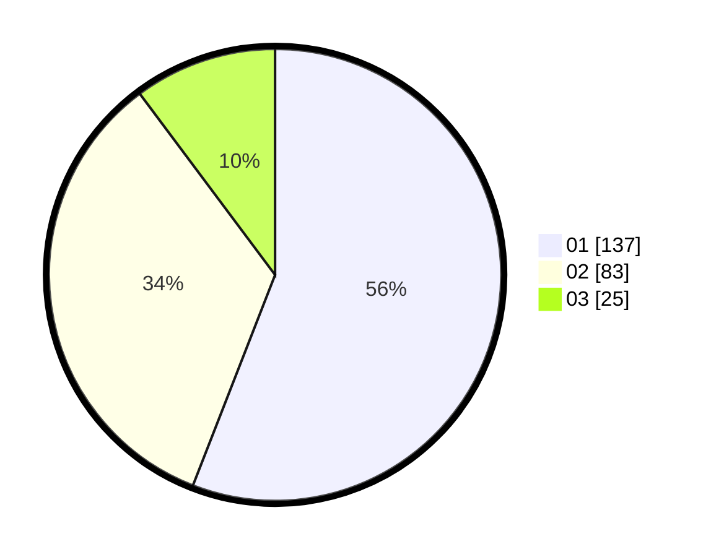

# Hasil

Hasil perolehan suara paslon dapat dilihat pada file paslon-01.txt, paslon-02.txt, dan paslon-03.txt.

Jika tidak ada, artinya data tersebut belum ada pada SIREKAP.

## Perolehan Suara

 * Paslon 01: **137**.
 * Paslon 02: **83**.
 * Paslon 03: **25**.

## Foto C Plano

https://sirekap-obj-formc.kpu.go.id/cf66/pemilu/ppwp/31/74/10/10/05/3174101005060-20240216-193317--bf1ef0a5-7457-4414-9b30-f94ee1105a65.jpg

https://sirekap-obj-formc.kpu.go.id/cf66/pemilu/ppwp/31/74/10/10/05/3174101005060-20240216-193318--8b27463d-0da5-44be-a084-dc2036c7b6fe.jpg

https://sirekap-obj-formc.kpu.go.id/cf66/pemilu/ppwp/31/74/10/10/05/3174101005060-20240216-193317--d692a4ec-cfd9-4cbf-bccc-3d5692d31e18.jpg

## DATA PEMILIH TETAP

Jumlah pemilih dalam DPT: **288**.
 * L: **155**.
 * P: **133**.

## DATA PENGGUNA HAK PILIH

Jumlah pengguna hak pilih dalam DPT: **243**.
 * L: **129**.
 * P: **114**.

Jumlah pengguna hak pilih dalam DPTb: **0**.
 * L: **0**.
 * P: **0**.

Jumlah pengguna hak pilih dalam DPK: **3**.
 * L: **0**.
 * P: **3**.

Jumlah pengguna hak pilih: **246**.
 * L: **129**.
 * P: **117**.

## JUMLAH SUARA SAH DAN TIDAK SAH

JUMLAH SELURUH SUARA SAH: **245**.

JUMLAH SUARA TIDAK SAH: **1**.

JUMLAH SELURUH SUARA SAH DAN SUARA TIDAK SAH: **246**.
