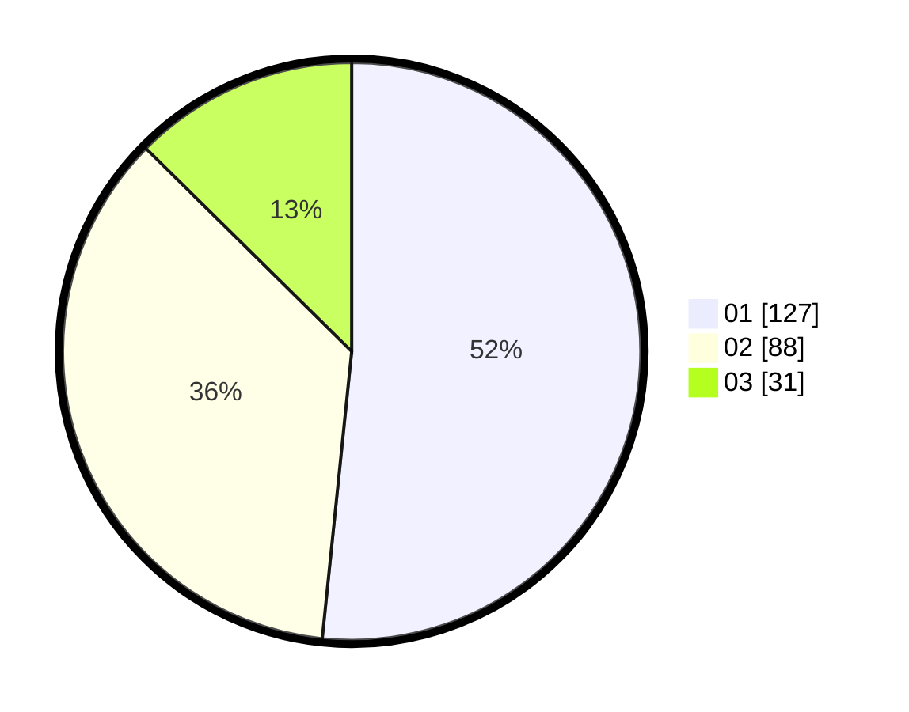

# Hasil

Hasil perolehan suara paslon dapat dilihat pada file paslon-01.txt, paslon-02.txt, dan paslon-03.txt.

Jika tidak ada, artinya data tersebut belum ada pada SIREKAP.

## Perolehan Suara

 * Paslon 01: **127**.
 * Paslon 02: **88**.
 * Paslon 03: **31**.

## Foto C Plano

https://sirekap-obj-formc.kpu.go.id/785f/pemilu/ppwp/31/74/10/10/05/3174101005061-20240216-212116--918d47e4-4f5f-4b18-a5e9-346704ca1247.jpg

https://sirekap-obj-formc.kpu.go.id/785f/pemilu/ppwp/31/74/10/10/05/3174101005061-20240216-212117--6e1c7706-c184-4b0a-892a-fb26522474e2.jpg

https://sirekap-obj-formc.kpu.go.id/785f/pemilu/ppwp/31/74/10/10/05/3174101005061-20240216-212117--fddf26b6-a690-4b47-a51c-6c7b8b14c009.jpg

## DATA PEMILIH TETAP

Jumlah pemilih dalam DPT: **283**.
 * L: **141**.
 * P: **142**.

## DATA PENGGUNA HAK PILIH

Jumlah pengguna hak pilih dalam DPT: **247**.
 * L: **120**.
 * P: **127**.

Jumlah pengguna hak pilih dalam DPTb: **0**.
 * L: **0**.
 * P: **0**.

Jumlah pengguna hak pilih dalam DPK: **1**.
 * L: **1**.
 * P: **0**.

Jumlah pengguna hak pilih: **248**.
 * L: **121**.
 * P: **127**.

## JUMLAH SUARA SAH DAN TIDAK SAH

JUMLAH SELURUH SUARA SAH: **246**.

JUMLAH SUARA TIDAK SAH: **2**.

JUMLAH SELURUH SUARA SAH DAN SUARA TIDAK SAH: **248**.
