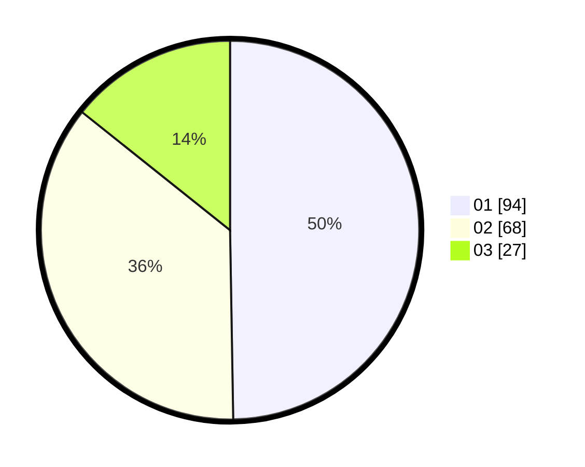

# Hasil

Hasil perolehan suara paslon dapat dilihat pada file paslon-01.txt, paslon-02.txt, dan paslon-03.txt.

Jika tidak ada, artinya data tersebut belum ada pada SIREKAP.

## Perolehan Suara

 * Paslon 01: **94**.
 * Paslon 02: **68**.
 * Paslon 03: **27**.

## Foto C Plano

https://sirekap-obj-formc.kpu.go.id/db17/pemilu/ppwp/31/74/10/10/05/3174101005066-20240214-155206--b14cfbc4-d705-4274-b7b8-3d6dc104ef2b.jpg

https://sirekap-obj-formc.kpu.go.id/db17/pemilu/ppwp/31/74/10/10/05/3174101005066-20240214-141646--ea294cd6-04b3-495e-8d1e-7d9823fdc9ba.jpg

https://sirekap-obj-formc.kpu.go.id/db17/pemilu/ppwp/31/74/10/10/05/3174101005066-20240214-184743--685c34f3-01d3-47d8-a990-aca3fe647e48.jpg

## DATA PEMILIH TETAP

Jumlah pemilih dalam DPT: **240**.
 * L: **118**.
 * P: **122**.

## DATA PENGGUNA HAK PILIH

Jumlah pengguna hak pilih dalam DPT: **187**.
 * L: **89**.
 * P: **98**.

Jumlah pengguna hak pilih dalam DPTb: **0**.
 * L: **0**.
 * P: **0**.

Jumlah pengguna hak pilih dalam DPK: **4**.
 * L: **2**.
 * P: **2**.

Jumlah pengguna hak pilih: **191**.
 * L: **91**.
 * P: **100**.

## JUMLAH SUARA SAH DAN TIDAK SAH

JUMLAH SELURUH SUARA SAH: **189**.

JUMLAH SUARA TIDAK SAH: **2**.

JUMLAH SELURUH SUARA SAH DAN SUARA TIDAK SAH: **191**.
