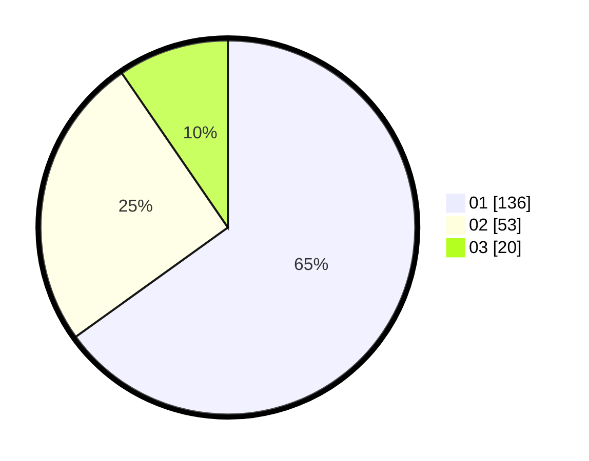

# Hasil

Hasil perolehan suara paslon dapat dilihat pada file paslon-01.txt, paslon-02.txt, dan paslon-03.txt.

Jika tidak ada, artinya data tersebut belum ada pada SIREKAP.

## Perolehan Suara

 * Paslon 01: **136**.
 * Paslon 02: **53**.
 * Paslon 03: **20**.

## Foto C Plano

https://sirekap-obj-formc.kpu.go.id/00a2/pemilu/ppwp/31/74/10/10/05/3174101005078-20240215-214359--b0ea5d23-9747-4cb4-aee7-ea3233187389.jpg

https://sirekap-obj-formc.kpu.go.id/00a2/pemilu/ppwp/31/74/10/10/05/3174101005078-20240214-210140--4931f4f7-6292-4fc6-8e74-b0cb9da9718c.jpg

https://sirekap-obj-formc.kpu.go.id/00a2/pemilu/ppwp/31/74/10/10/05/3174101005078-20240214-210257--68333e62-e3aa-4125-836b-91b853780a4a.jpg
