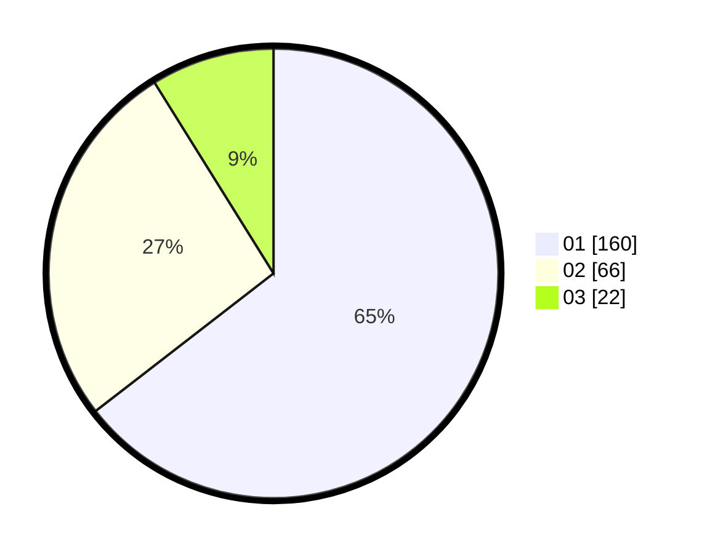

# Hasil

Hasil perolehan suara paslon dapat dilihat pada file paslon-01.txt, paslon-02.txt, dan paslon-03.txt.

Jika tidak ada, artinya data tersebut belum ada pada SIREKAP.

## Perolehan Suara

 * Paslon 01: **160**.
 * Paslon 02: **66**.
 * Paslon 03: **22**.

## Foto C Plano

https://sirekap-obj-formc.kpu.go.id/97df/pemilu/ppwp/31/74/10/10/05/3174101005083-20240214-195813--aecf5a26-efdc-4cfd-af3d-996525c7d1d0.jpg

https://sirekap-obj-formc.kpu.go.id/97df/pemilu/ppwp/31/74/10/10/05/3174101005083-20240214-195911--eee450d4-5833-47b7-9042-d3005e09dbb0.jpg

https://sirekap-obj-formc.kpu.go.id/97df/pemilu/ppwp/31/74/10/10/05/3174101005083-20240214-200000--465a88d9-8ad8-458a-b663-05bf692c9633.jpg

## DATA PEMILIH TETAP

Jumlah pemilih dalam DPT: **279**.
 * L: **142**.
 * P: **137**.

## DATA PENGGUNA HAK PILIH

Jumlah pengguna hak pilih dalam DPT: **236**.
 * L: **119**.
 * P: **117**.

Jumlah pengguna hak pilih dalam DPTb: **8**.
 * L: **4**.
 * P: **4**.

Jumlah pengguna hak pilih dalam DPK: **4**.
 * L: **1**.
 * P: **3**.

Jumlah pengguna hak pilih: **248**.
 * L: **124**.
 * P: **124**.

## JUMLAH SUARA SAH DAN TIDAK SAH

JUMLAH SELURUH SUARA SAH: **248**.

JUMLAH SUARA TIDAK SAH: **0**.

JUMLAH SELURUH SUARA SAH DAN SUARA TIDAK SAH: **248**.
