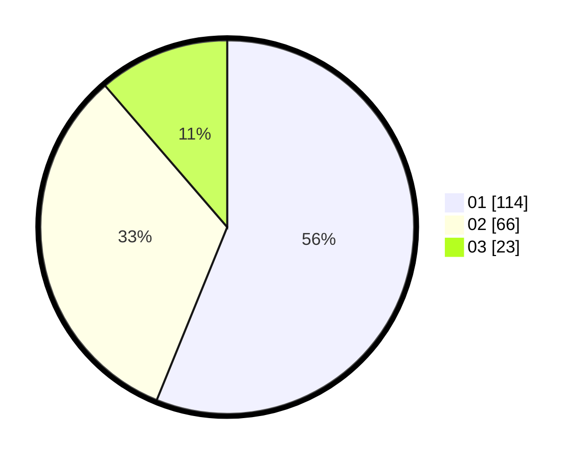

# Hasil

Hasil perolehan suara paslon dapat dilihat pada file paslon-01.txt, paslon-02.txt, dan paslon-03.txt.

Jika tidak ada, artinya data tersebut belum ada pada SIREKAP.

## Perolehan Suara

 * Paslon 01: **114**.
 * Paslon 02: **66**.
 * Paslon 03: **23**.

## Foto C Plano

https://sirekap-obj-formc.kpu.go.id/8a41/pemilu/ppwp/31/74/10/10/05/3174101005087-20240216-085516--cdfa4ed2-e769-4958-b700-d0b679b35682.jpg

https://sirekap-obj-formc.kpu.go.id/8a41/pemilu/ppwp/31/74/10/10/05/3174101005087-20240215-003510--b2b569f9-67c9-4070-89e3-fbf632eabccc.jpg

https://sirekap-obj-formc.kpu.go.id/8a41/pemilu/ppwp/31/74/10/10/05/3174101005087-20240215-003637--74949b7c-c0a9-4bcd-b23a-60b75dcd8d8c.jpg

## DATA PEMILIH TETAP

Jumlah pemilih dalam DPT: **257**.
 * L: **124**.
 * P: **133**.

## DATA PENGGUNA HAK PILIH

Jumlah pengguna hak pilih dalam DPT: **201**.
 * L: **92**.
 * P: **109**.

Jumlah pengguna hak pilih dalam DPTb: **0**.
 * L: **0**.
 * P: **0**.

Jumlah pengguna hak pilih dalam DPK: **5**.
 * L: **3**.
 * P: **2**.

Jumlah pengguna hak pilih: **206**.
 * L: **95**.
 * P: **111**.

## JUMLAH SUARA SAH DAN TIDAK SAH

JUMLAH SELURUH SUARA SAH: **203**.

JUMLAH SUARA TIDAK SAH: **3**.

JUMLAH SELURUH SUARA SAH DAN SUARA TIDAK SAH: **206**.
