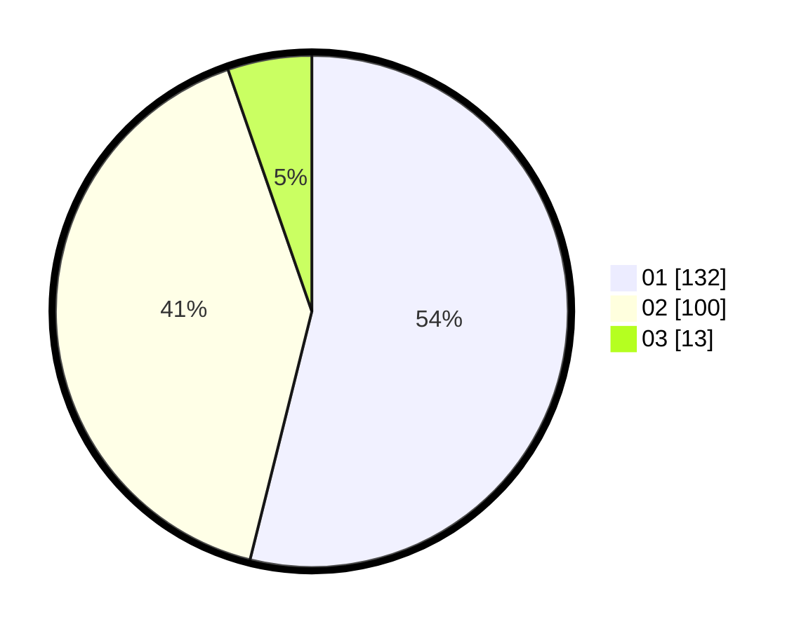

# Hasil

Hasil perolehan suara paslon dapat dilihat pada file paslon-01.txt, paslon-02.txt, dan paslon-03.txt.

Jika tidak ada, artinya data tersebut belum ada pada SIREKAP.

## Perolehan Suara

 * Paslon 01: **132**.
 * Paslon 02: **100**.
 * Paslon 03: **13**.

## Foto C Plano

https://sirekap-obj-formc.kpu.go.id/0d7b/pemilu/ppwp/31/74/10/10/05/3174101005101-20240214-202403--39be065e-392e-4ee5-ae9d-5058cc3883f2.jpg

https://sirekap-obj-formc.kpu.go.id/0d7b/pemilu/ppwp/31/74/10/10/05/3174101005101-20240214-202556--edc3c40c-8dbc-4753-9081-33bf7a18cb4d.jpg

https://sirekap-obj-formc.kpu.go.id/0d7b/pemilu/ppwp/31/74/10/10/05/3174101005101-20240214-202711--da8a71e4-f9fa-480b-aeb1-e7e92883f39d.jpg

## DATA PEMILIH TETAP

Jumlah pemilih dalam DPT: **279**.
 * L: **140**.
 * P: **139**.

## DATA PENGGUNA HAK PILIH

Jumlah pengguna hak pilih dalam DPT: **247**.
 * L: **123**.
 * P: **124**.

Jumlah pengguna hak pilih dalam DPTb: **0**.
 * L: **0**.
 * P: **0**.

Jumlah pengguna hak pilih dalam DPK: **1**.
 * L: **1**.
 * P: **0**.

Jumlah pengguna hak pilih: **248**.
 * L: **124**.
 * P: **124**.

## JUMLAH SUARA SAH DAN TIDAK SAH

JUMLAH SELURUH SUARA SAH: **245**.

JUMLAH SUARA TIDAK SAH: **3**.

JUMLAH SELURUH SUARA SAH DAN SUARA TIDAK SAH: **248**.
