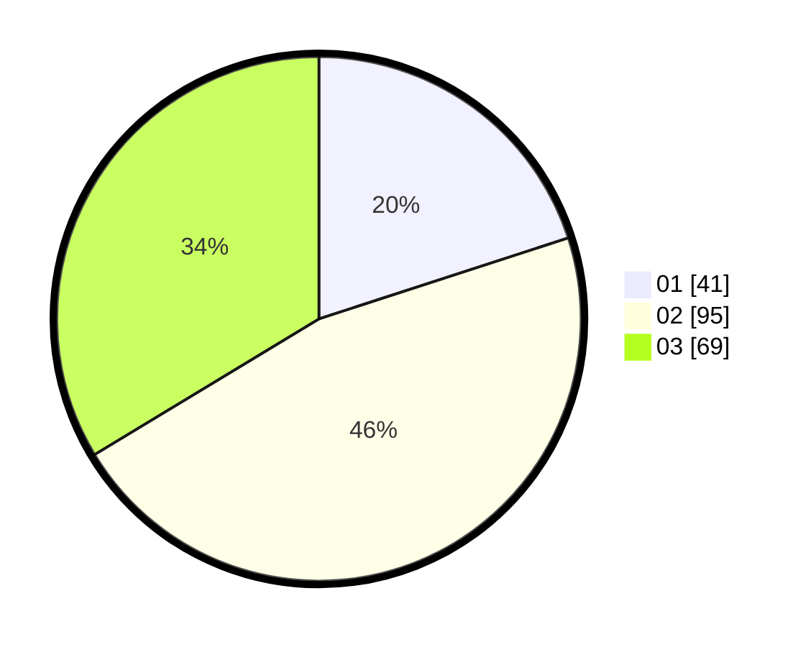

# Hasil

Hasil perolehan suara paslon dapat dilihat pada file paslon-01.txt, paslon-02.txt, dan paslon-03.txt.

Jika tidak ada, artinya data tersebut belum ada pada SIREKAP.

## Perolehan Suara

 * Paslon 01: **41**.
 * Paslon 02: **95**.
 * Paslon 03: **69**.

## Foto C Plano

https://sirekap-obj-formc.kpu.go.id/d371/pemilu/ppwp/31/74/10/10/05/3174101005123-20240217-115018--da6246ea-9750-418a-a532-9524338786b6.jpg

https://sirekap-obj-formc.kpu.go.id/d371/pemilu/ppwp/31/74/10/10/05/3174101005123-20240217-115019--cb2edf33-a788-427f-b307-ba7ac238720b.jpg

https://sirekap-obj-formc.kpu.go.id/d371/pemilu/ppwp/31/74/10/10/05/3174101005123-20240217-115019--a9a60ff0-e932-410e-b6f2-387a2ffe7fa4.jpg

## DATA PEMILIH TETAP

Jumlah pemilih dalam DPT: **258**.
 * L: **104**.
 * P: **154**.

## DATA PENGGUNA HAK PILIH

Jumlah pengguna hak pilih dalam DPT: **199**.
 * L: **78**.
 * P: **121**.

Jumlah pengguna hak pilih dalam DPTb: **6**.
 * L: **3**.
 * P: **3**.

Jumlah pengguna hak pilih dalam DPK: **2**.
 * L: **1**.
 * P: **1**.

Jumlah pengguna hak pilih: **207**.
 * L: **82**.
 * P: **125**.

## JUMLAH SUARA SAH DAN TIDAK SAH

JUMLAH SELURUH SUARA SAH: **205**.

JUMLAH SUARA TIDAK SAH: **2**.

JUMLAH SELURUH SUARA SAH DAN SUARA TIDAK SAH: **207**.
