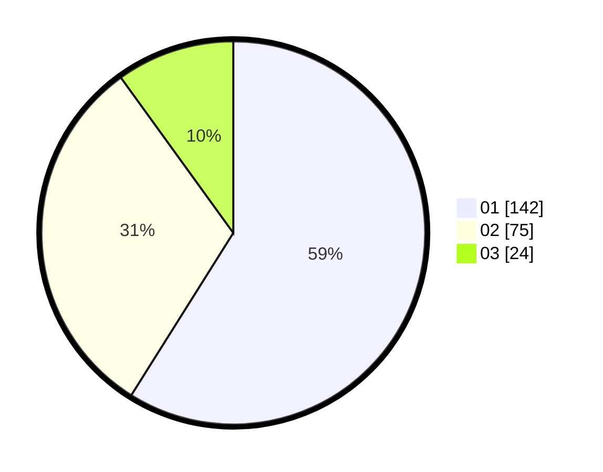

# Hasil

Hasil perolehan suara paslon dapat dilihat pada file paslon-01.txt, paslon-02.txt, dan paslon-03.txt.

Jika tidak ada, artinya data tersebut belum ada pada SIREKAP.

## Perolehan Suara

 * Paslon 01: **142**.
 * Paslon 02: **75**.
 * Paslon 03: **24**.

## Foto C Plano

https://sirekap-obj-formc.kpu.go.id/9e85/pemilu/ppwp/31/74/10/10/05/3174101005127-20240214-190824--67ece74d-b574-49de-b498-7521e089e846.jpg

https://sirekap-obj-formc.kpu.go.id/9e85/pemilu/ppwp/31/74/10/10/05/3174101005127-20240214-191116--ac943e73-673c-486b-a563-e0a9813f5473.jpg

https://sirekap-obj-formc.kpu.go.id/9e85/pemilu/ppwp/31/74/10/10/05/3174101005127-20240214-185959--381b0498-d80d-4109-ae71-3abb4bcdf6e3.jpg

## DATA PEMILIH TETAP

Jumlah pemilih dalam DPT: **283**.
 * L: **149**.
 * P: **134**.

## DATA PENGGUNA HAK PILIH

Jumlah pengguna hak pilih dalam DPT: **283**.
 * L: **149**.
 * P: **134**.

Jumlah pengguna hak pilih dalam DPTb: **19**.
 * L: **7**.
 * P: **12**.

Jumlah pengguna hak pilih dalam DPK: **0**.
 * L: **0**.
 * P: **0**.

Jumlah pengguna hak pilih: **302**.
 * L: **156**.
 * P: **146**.

## JUMLAH SUARA SAH DAN TIDAK SAH

JUMLAH SELURUH SUARA SAH: **242**.

JUMLAH SUARA TIDAK SAH: **1**.

JUMLAH SELURUH SUARA SAH DAN SUARA TIDAK SAH: **243**.
