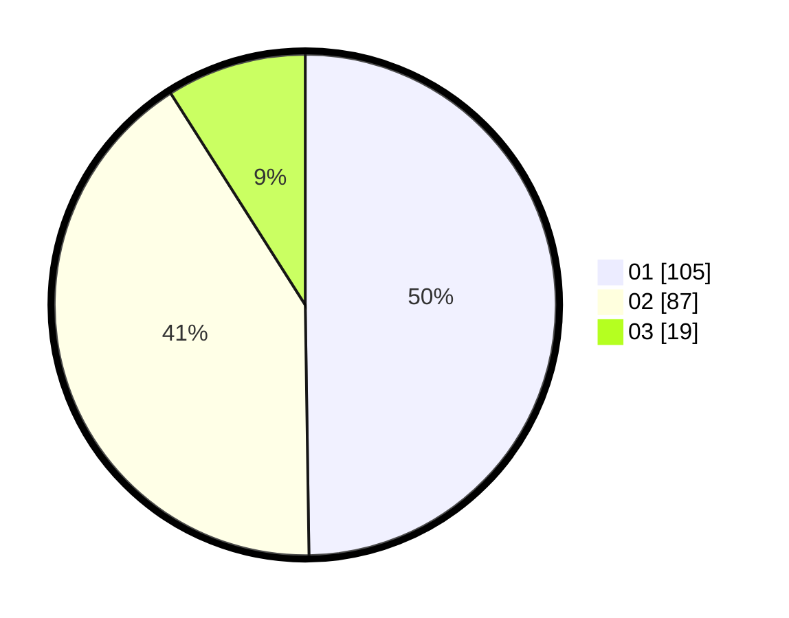

# Hasil

Hasil perolehan suara paslon dapat dilihat pada file paslon-01.txt, paslon-02.txt, dan paslon-03.txt.

Jika tidak ada, artinya data tersebut belum ada pada SIREKAP.

## Perolehan Suara

 * Paslon 01: **105**.
 * Paslon 02: **87**.
 * Paslon 03: **19**.

## Foto C Plano

https://sirekap-obj-formc.kpu.go.id/4967/pemilu/ppwp/31/74/10/10/05/3174101005129-20240216-003523--3fa424a2-51e6-48bc-a25d-a28d9b34b623.jpg

https://sirekap-obj-formc.kpu.go.id/4967/pemilu/ppwp/31/74/10/10/05/3174101005129-20240216-003530--13a688dd-fa33-4ad9-ba94-fe20bf80d60d.jpg

https://sirekap-obj-formc.kpu.go.id/4967/pemilu/ppwp/31/74/10/10/05/3174101005129-20240216-014001--29985871-2314-408e-abf8-493f07024a50.jpg

## DATA PEMILIH TETAP

Jumlah pemilih dalam DPT: **262**.
 * L: **128**.
 * P: **134**.

## DATA PENGGUNA HAK PILIH

Jumlah pengguna hak pilih dalam DPT: **210**.
 * L: **99**.
 * P: **111**.

Jumlah pengguna hak pilih dalam DPTb: **0**.
 * L: **0**.
 * P: **0**.

Jumlah pengguna hak pilih dalam DPK: **3**.
 * L: **1**.
 * P: **2**.

Jumlah pengguna hak pilih: **213**.
 * L: **100**.
 * P: **113**.

## JUMLAH SUARA SAH DAN TIDAK SAH

JUMLAH SELURUH SUARA SAH: **211**.

JUMLAH SUARA TIDAK SAH: **2**.

JUMLAH SELURUH SUARA SAH DAN SUARA TIDAK SAH: **213**.
