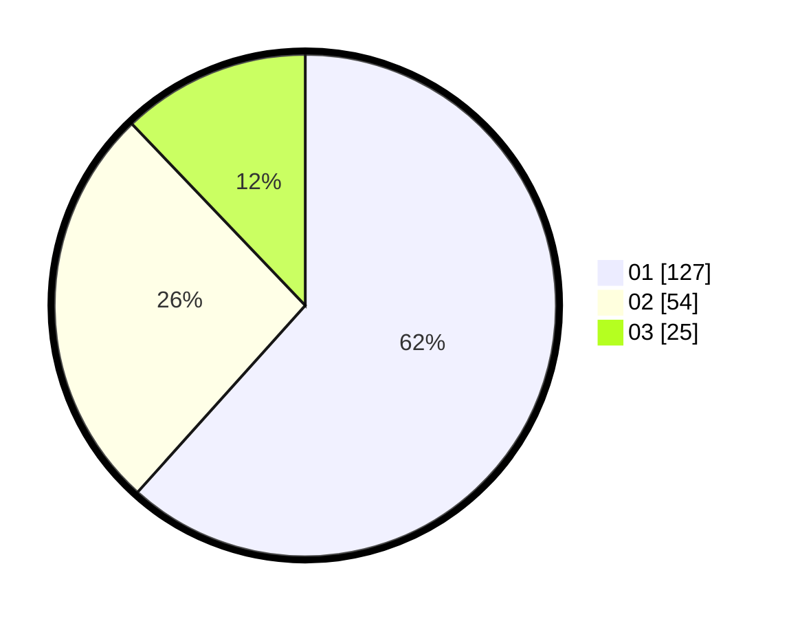

# Hasil

Hasil perolehan suara paslon dapat dilihat pada file paslon-01.txt, paslon-02.txt, dan paslon-03.txt.

Jika tidak ada, artinya data tersebut belum ada pada SIREKAP.

## Perolehan Suara

 * Paslon 01: **127**.
 * Paslon 02: **54**.
 * Paslon 03: **25**.

## Foto C Plano

https://sirekap-obj-formc.kpu.go.id/397f/pemilu/ppwp/31/74/10/10/05/3174101005131-20240214-155324--a4a9c0f8-461d-4ef1-96b0-59cba293367f.jpg

https://sirekap-obj-formc.kpu.go.id/397f/pemilu/ppwp/31/74/10/10/05/3174101005131-20240214-155645--64e7705f-1ea6-4ea8-8970-c181c88f1192.jpg

https://sirekap-obj-formc.kpu.go.id/397f/pemilu/ppwp/31/74/10/10/05/3174101005131-20240214-162227--060b0e01-2bd4-4428-bf73-11771eb74371.jpg

## DATA PEMILIH TETAP

Jumlah pemilih dalam DPT: **254**.
 * L: **130**.
 * P: **124**.

## DATA PENGGUNA HAK PILIH

Jumlah pengguna hak pilih dalam DPT: **206**.
 * L: **101**.
 * P: **105**.

Jumlah pengguna hak pilih dalam DPTb: **2**.
 * L: **1**.
 * P: **1**.

Jumlah pengguna hak pilih dalam DPK: **0**.
 * L: **0**.
 * P: **0**.

Jumlah pengguna hak pilih: **208**.
 * L: **102**.
 * P: **106**.

## JUMLAH SUARA SAH DAN TIDAK SAH

JUMLAH SELURUH SUARA SAH: **206**.

JUMLAH SUARA TIDAK SAH: **2**.

JUMLAH SELURUH SUARA SAH DAN SUARA TIDAK SAH: **208**.
