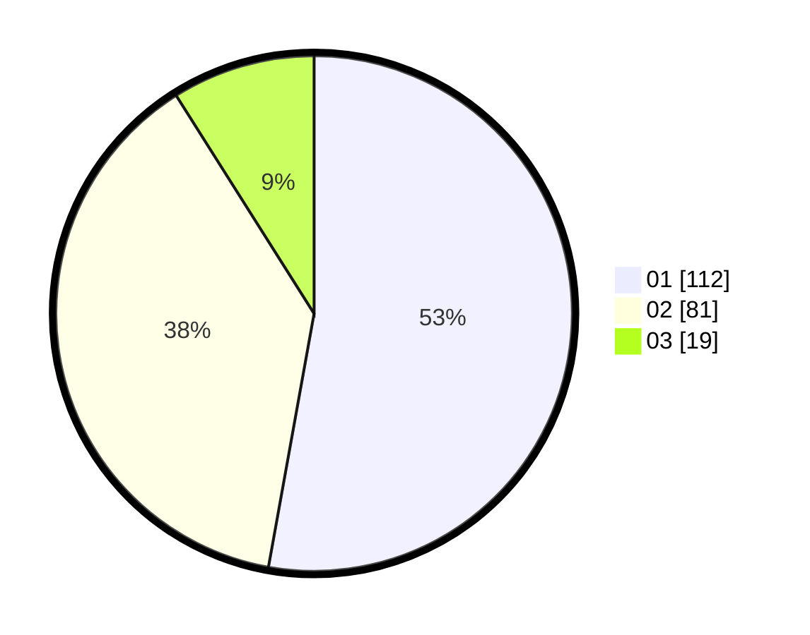

# Hasil

Hasil perolehan suara paslon dapat dilihat pada file paslon-01.txt, paslon-02.txt, dan paslon-03.txt.

Jika tidak ada, artinya data tersebut belum ada pada SIREKAP.

## Perolehan Suara

 * Paslon 01: **112**.
 * Paslon 02: **81**.
 * Paslon 03: **19**.

## Foto C Plano

https://sirekap-obj-formc.kpu.go.id/2f70/pemilu/ppwp/31/75/01/10/01/3175011001003-20240214-232057--70c01542-9ef9-4031-83b0-1a62251273b6.jpg

https://sirekap-obj-formc.kpu.go.id/2f70/pemilu/ppwp/31/75/01/10/01/3175011001003-20240214-212308--814a00fe-3c7b-44c8-997d-b4e7e79673f8.jpg

https://sirekap-obj-formc.kpu.go.id/2f70/pemilu/ppwp/31/75/01/10/01/3175011001003-20240214-235253--3eab213a-c3f0-43e8-b9f1-26f3e27482eb.jpg

## DATA PEMILIH TETAP

Jumlah pemilih dalam DPT: **267**.
 * L: **138**.
 * P: **129**.

## DATA PENGGUNA HAK PILIH

Jumlah pengguna hak pilih dalam DPT: **209**.
 * L: **107**.
 * P: **102**.

Jumlah pengguna hak pilih dalam DPTb: **3**.
 * L: **1**.
 * P: **2**.

Jumlah pengguna hak pilih dalam DPK: **1**.
 * L: **0**.
 * P: **1**.

Jumlah pengguna hak pilih: **213**.
 * L: **108**.
 * P: **105**.

## JUMLAH SUARA SAH DAN TIDAK SAH

JUMLAH SELURUH SUARA SAH: **212**.

JUMLAH SUARA TIDAK SAH: **1**.

JUMLAH SELURUH SUARA SAH DAN SUARA TIDAK SAH: **213**.
