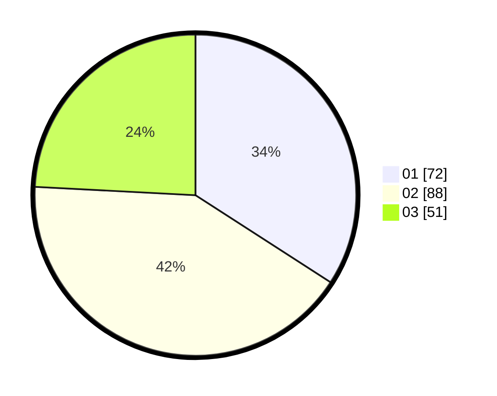

# Hasil

Hasil perolehan suara paslon dapat dilihat pada file paslon-01.txt, paslon-02.txt, dan paslon-03.txt.

Jika tidak ada, artinya data tersebut belum ada pada SIREKAP.

## Perolehan Suara

 * Paslon 01: **72**.
 * Paslon 02: **88**.
 * Paslon 03: **51**.

## Foto C Plano

https://sirekap-obj-formc.kpu.go.id/20e8/pemilu/ppwp/31/75/01/10/01/3175011001004-20240214-192235--657b06c2-eab2-4bf3-9f2c-987b095764da.jpg

https://sirekap-obj-formc.kpu.go.id/20e8/pemilu/ppwp/31/75/01/10/01/3175011001004-20240214-192326--1015f0c7-d9bb-4728-82f3-50c7ea7ff532.jpg

https://sirekap-obj-formc.kpu.go.id/20e8/pemilu/ppwp/31/75/01/10/01/3175011001004-20240214-192508--7e545484-b7d2-47d2-bc94-4a774b738c80.jpg

## DATA PEMILIH TETAP

Jumlah pemilih dalam DPT: **267**.
 * L: **127**.
 * P: **140**.

## DATA PENGGUNA HAK PILIH

Jumlah pengguna hak pilih dalam DPT: **208**.
 * L: **94**.
 * P: **114**.

Jumlah pengguna hak pilih dalam DPTb: **2**.
 * L: **1**.
 * P: **1**.

Jumlah pengguna hak pilih dalam DPK: **5**.
 * L: **1**.
 * P: **4**.

Jumlah pengguna hak pilih: **215**.
 * L: **96**.
 * P: **119**.

## JUMLAH SUARA SAH DAN TIDAK SAH

JUMLAH SELURUH SUARA SAH: **211**.

JUMLAH SUARA TIDAK SAH: **4**.

JUMLAH SELURUH SUARA SAH DAN SUARA TIDAK SAH: **215**.
