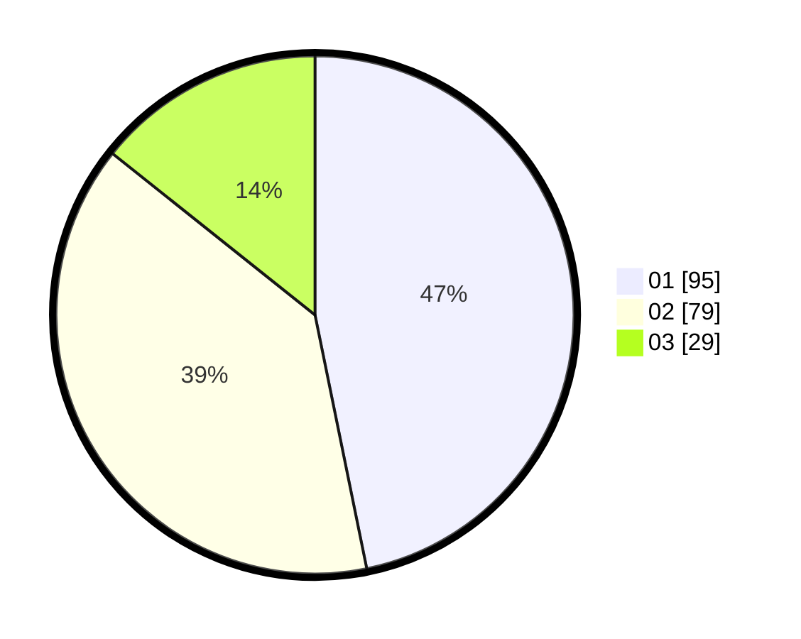

# Hasil

Hasil perolehan suara paslon dapat dilihat pada file paslon-01.txt, paslon-02.txt, dan paslon-03.txt.

Jika tidak ada, artinya data tersebut belum ada pada SIREKAP.

## Perolehan Suara

 * Paslon 01: **95**.
 * Paslon 02: **79**.
 * Paslon 03: **29**.

## Foto C Plano

https://sirekap-obj-formc.kpu.go.id/932f/pemilu/ppwp/31/75/01/10/01/3175011001008-20240214-175430--e35ca84a-ec2a-4751-86a0-b34a8ab2e86b.jpg

https://sirekap-obj-formc.kpu.go.id/932f/pemilu/ppwp/31/75/01/10/01/3175011001008-20240215-122909--3a0aa2e3-9bb6-4658-925f-7038b8571832.jpg

https://sirekap-obj-formc.kpu.go.id/932f/pemilu/ppwp/31/75/01/10/01/3175011001008-20240214-183202--c761d6fe-abae-491c-99ad-fe3fe3e6ef36.jpg

## DATA PEMILIH TETAP

Jumlah pemilih dalam DPT: **272**.
 * L: **136**.
 * P: **136**.

## DATA PENGGUNA HAK PILIH

Jumlah pengguna hak pilih dalam DPT: **207**.
 * L: **103**.
 * P: **104**.

Jumlah pengguna hak pilih dalam DPTb: **0**.
 * L: **0**.
 * P: **0**.

Jumlah pengguna hak pilih dalam DPK: **1**.
 * L: **0**.
 * P: **1**.

Jumlah pengguna hak pilih: **208**.
 * L: **103**.
 * P: **105**.

## JUMLAH SUARA SAH DAN TIDAK SAH

JUMLAH SELURUH SUARA SAH: **203**.

JUMLAH SUARA TIDAK SAH: **5**.

JUMLAH SELURUH SUARA SAH DAN SUARA TIDAK SAH: **208**.
