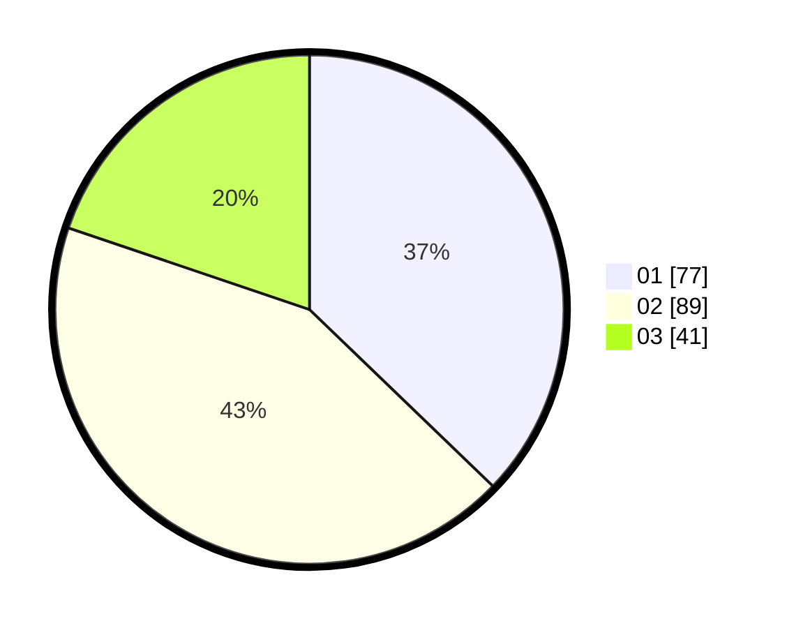

# Hasil

Hasil perolehan suara paslon dapat dilihat pada file paslon-01.txt, paslon-02.txt, dan paslon-03.txt.

Jika tidak ada, artinya data tersebut belum ada pada SIREKAP.

## Perolehan Suara

 * Paslon 01: **77**.
 * Paslon 02: **89**.
 * Paslon 03: **41**.

## Foto C Plano

https://sirekap-obj-formc.kpu.go.id/9c31/pemilu/ppwp/31/75/01/10/01/3175011001009-20240214-214650--af2294aa-fdeb-49ad-bb11-4da9c581b355.jpg

https://sirekap-obj-formc.kpu.go.id/9c31/pemilu/ppwp/31/75/01/10/01/3175011001009-20240214-205334--39e7b433-6a41-431c-a87b-31c9ffeb85de.jpg

https://sirekap-obj-formc.kpu.go.id/9c31/pemilu/ppwp/31/75/01/10/01/3175011001009-20240214-231410--870ee213-c3f1-4372-a484-a0bbad2e777c.jpg
