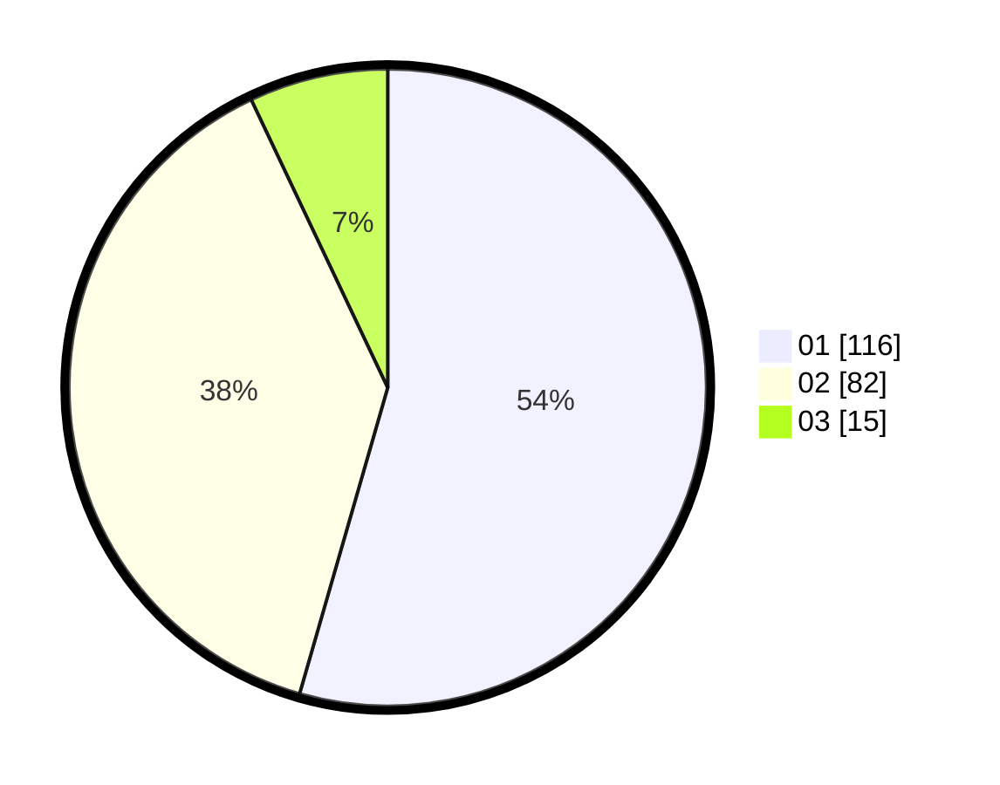

# Hasil

Hasil perolehan suara paslon dapat dilihat pada file paslon-01.txt, paslon-02.txt, dan paslon-03.txt.

Jika tidak ada, artinya data tersebut belum ada pada SIREKAP.

## Perolehan Suara

 * Paslon 01: **116**.
 * Paslon 02: **82**.
 * Paslon 03: **15**.

## Foto C Plano

https://sirekap-obj-formc.kpu.go.id/da27/pemilu/ppwp/31/75/01/10/01/3175011001010-20240214-190648--9a6659df-ef7f-4494-8acc-786125b79e96.jpg

https://sirekap-obj-formc.kpu.go.id/da27/pemilu/ppwp/31/75/01/10/01/3175011001010-20240214-190944--5a73707b-2e45-4a2f-aa16-52baea402a05.jpg

https://sirekap-obj-formc.kpu.go.id/da27/pemilu/ppwp/31/75/01/10/01/3175011001010-20240214-200221--8ac5a58f-bfed-4869-ad1e-31d8db9da1a4.jpg
