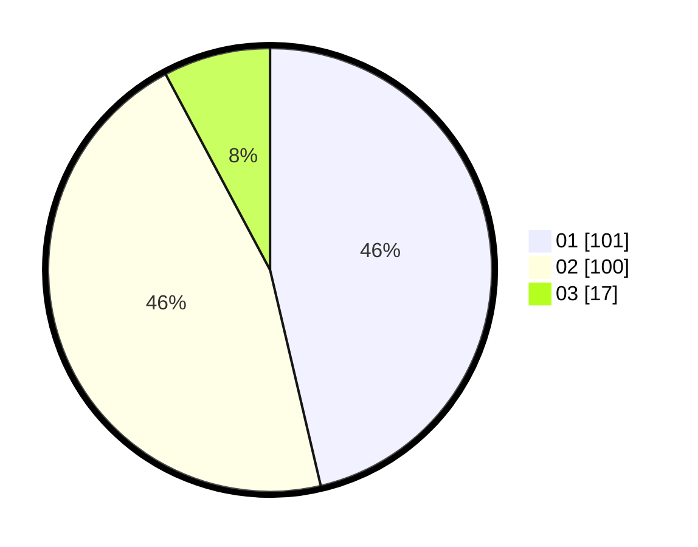

# Hasil

Hasil perolehan suara paslon dapat dilihat pada file paslon-01.txt, paslon-02.txt, dan paslon-03.txt.

Jika tidak ada, artinya data tersebut belum ada pada SIREKAP.

## Perolehan Suara

 * Paslon 01: **101**.
 * Paslon 02: **100**.
 * Paslon 03: **17**.

## Foto C Plano

https://sirekap-obj-formc.kpu.go.id/50d5/pemilu/ppwp/31/75/01/10/01/3175011001012-20240215-015451--6c89f0f7-fd68-4677-bfd0-46876adea322.jpg

https://sirekap-obj-formc.kpu.go.id/50d5/pemilu/ppwp/31/75/01/10/01/3175011001012-20240215-020325--66abadb7-f4f5-470e-8689-4a5a3562dad4.jpg

https://sirekap-obj-formc.kpu.go.id/50d5/pemilu/ppwp/31/75/01/10/01/3175011001012-20240215-020541--ca4b590c-d8a4-4c00-8c01-da5fd33a0771.jpg
