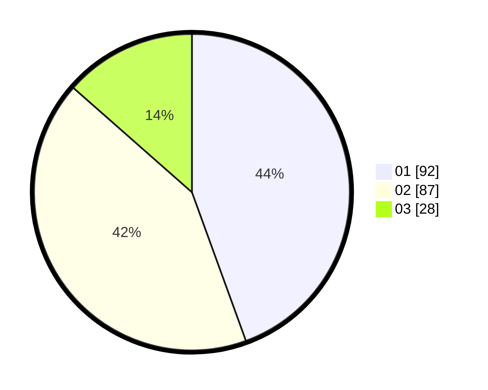

# Hasil

Hasil perolehan suara paslon dapat dilihat pada file paslon-01.txt, paslon-02.txt, dan paslon-03.txt.

Jika tidak ada, artinya data tersebut belum ada pada SIREKAP.

## Perolehan Suara

 * Paslon 01: **92**.
 * Paslon 02: **87**.
 * Paslon 03: **28**.

## Foto C Plano

https://sirekap-obj-formc.kpu.go.id/8031/pemilu/ppwp/31/75/01/10/01/3175011001015-20240214-212453--f13eff75-b366-4674-a095-fb3cfa2f93ff.jpg

https://sirekap-obj-formc.kpu.go.id/8031/pemilu/ppwp/31/75/01/10/01/3175011001015-20240214-213018--218ad132-1adb-46b5-9a2c-9259f2f10110.jpg

https://sirekap-obj-formc.kpu.go.id/8031/pemilu/ppwp/31/75/01/10/01/3175011001015-20240214-213132--73d5ba2b-b3d5-47a6-bce6-2538b88f45a0.jpg
