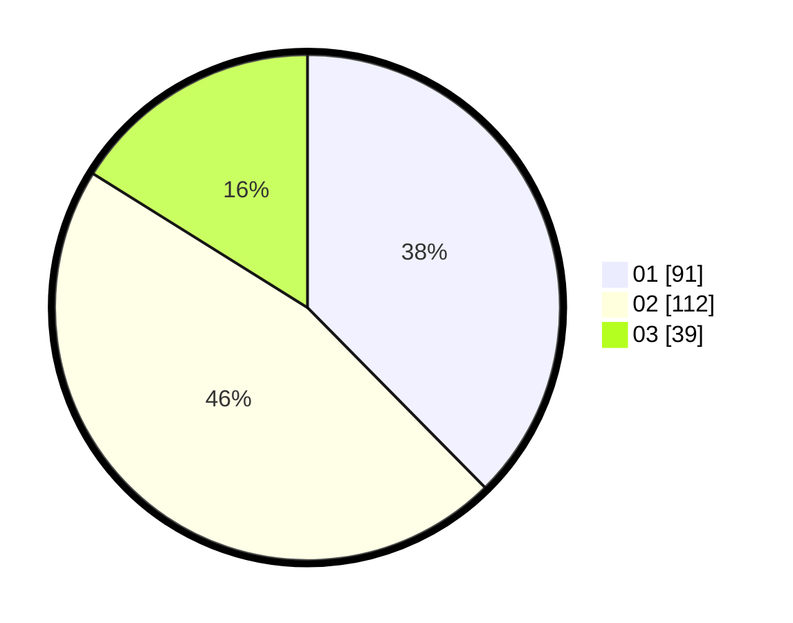

# Hasil

Hasil perolehan suara paslon dapat dilihat pada file paslon-01.txt, paslon-02.txt, dan paslon-03.txt.

Jika tidak ada, artinya data tersebut belum ada pada SIREKAP.

## Perolehan Suara

 * Paslon 01: **91**.
 * Paslon 02: **112**.
 * Paslon 03: **39**.

## Foto C Plano

https://sirekap-obj-formc.kpu.go.id/d2f3/pemilu/ppwp/31/75/01/10/01/3175011001021-20240214-193846--e94fac2d-ca56-4a38-a8e9-8adda9ab49e4.jpg

https://sirekap-obj-formc.kpu.go.id/d2f3/pemilu/ppwp/31/75/01/10/01/3175011001021-20240214-193956--02ed0e30-65b7-44e9-a0b7-8f16f17cbca3.jpg

https://sirekap-obj-formc.kpu.go.id/d2f3/pemilu/ppwp/31/75/01/10/01/3175011001021-20240214-195001--1e7fb98a-66bf-45a5-b39a-ffb1380ee8d2.jpg

## DATA PEMILIH TETAP

Jumlah pemilih dalam DPT: **287**.
 * L: **134**.
 * P: **153**.

## DATA PENGGUNA HAK PILIH

Jumlah pengguna hak pilih dalam DPT: **244**.
 * L: **112**.
 * P: **132**.

Jumlah pengguna hak pilih dalam DPTb: **0**.
 * L: **0**.
 * P: **0**.

Jumlah pengguna hak pilih dalam DPK: **1**.
 * L: **1**.
 * P: **0**.

Jumlah pengguna hak pilih: **245**.
 * L: **113**.
 * P: **132**.

## JUMLAH SUARA SAH DAN TIDAK SAH

JUMLAH SELURUH SUARA SAH: **242**.

JUMLAH SUARA TIDAK SAH: **3**.

JUMLAH SELURUH SUARA SAH DAN SUARA TIDAK SAH: **245**.
