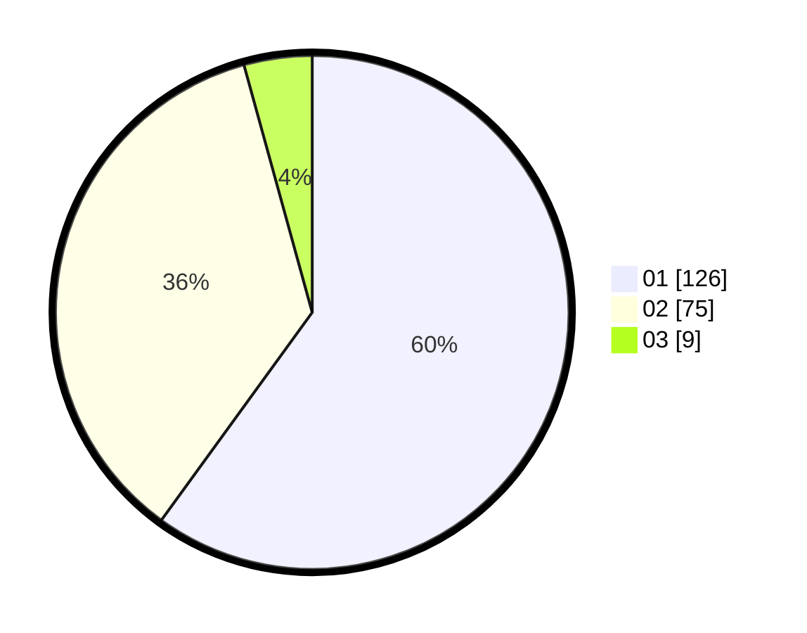

# Hasil

Hasil perolehan suara paslon dapat dilihat pada file paslon-01.txt, paslon-02.txt, dan paslon-03.txt.

Jika tidak ada, artinya data tersebut belum ada pada SIREKAP.

## Perolehan Suara

 * Paslon 01: **126**.
 * Paslon 02: **75**.
 * Paslon 03: **9**.

## Foto C Plano

https://sirekap-obj-formc.kpu.go.id/13fd/pemilu/ppwp/31/75/01/10/01/3175011001022-20240214-235533--584ea5af-59e6-4e7a-86e5-f6be4406846a.jpg

https://sirekap-obj-formc.kpu.go.id/13fd/pemilu/ppwp/31/75/01/10/01/3175011001022-20240214-235654--43cc400e-0516-433e-a910-1e1b9138b5ce.jpg

https://sirekap-obj-formc.kpu.go.id/13fd/pemilu/ppwp/31/75/01/10/01/3175011001022-20240214-235810--ac9bb3e2-a0b2-4510-85ac-37301b99fbfc.jpg
