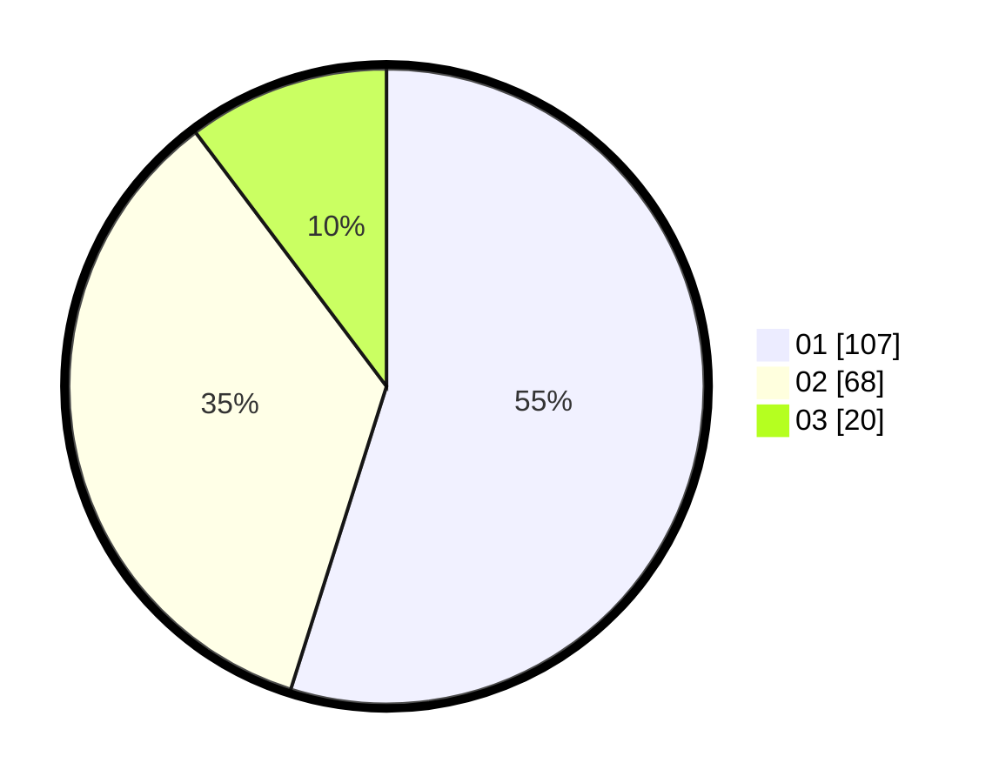

# Hasil

Hasil perolehan suara paslon dapat dilihat pada file paslon-01.txt, paslon-02.txt, dan paslon-03.txt.

Jika tidak ada, artinya data tersebut belum ada pada SIREKAP.

## Perolehan Suara

 * Paslon 01: **107**.
 * Paslon 02: **68**.
 * Paslon 03: **20**.

## Foto C Plano

https://sirekap-obj-formc.kpu.go.id/bd09/pemilu/ppwp/31/75/01/10/01/3175011001023-20240214-224542--90f1da32-25d3-42ec-a0a1-ed1c9b35c0b2.jpg

https://sirekap-obj-formc.kpu.go.id/bd09/pemilu/ppwp/31/75/01/10/01/3175011001023-20240214-224653--f89f901b-7ac0-4544-8f22-38c950884028.jpg

https://sirekap-obj-formc.kpu.go.id/bd09/pemilu/ppwp/31/75/01/10/01/3175011001023-20240214-224855--35b67620-2fa6-4ce5-bcf7-b7ead2b50565.jpg

## DATA PEMILIH TETAP

Jumlah pemilih dalam DPT: **247**.
 * L: **114**.
 * P: **133**.

## DATA PENGGUNA HAK PILIH

Jumlah pengguna hak pilih dalam DPT: **194**.
 * L: **88**.
 * P: **106**.

Jumlah pengguna hak pilih dalam DPTb: **2**.
 * L: **2**.
 * P: **0**.

Jumlah pengguna hak pilih dalam DPK: **0**.
 * L: **0**.
 * P: **0**.

Jumlah pengguna hak pilih: **196**.
 * L: **90**.
 * P: **106**.

## JUMLAH SUARA SAH DAN TIDAK SAH

JUMLAH SELURUH SUARA SAH: **195**.

JUMLAH SUARA TIDAK SAH: **1**.

JUMLAH SELURUH SUARA SAH DAN SUARA TIDAK SAH: **196**.
